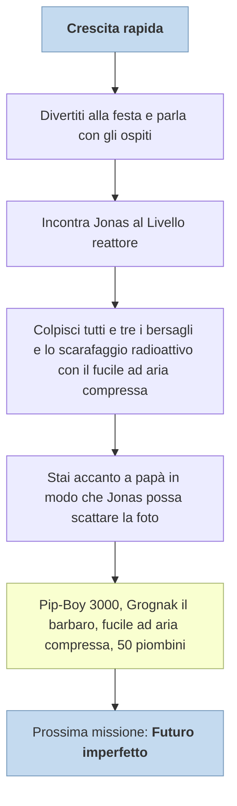

---
# Title, summary, and page position.
linktitle: Crescita rapida
summary: 'TODO'
weight: 40
icon: messages # message-question per le missioni nascoste
icon_pack: fas

# Page metadata.
title: Crescita rapida
date: 2022-11-15
type: book # Do not modify.
commentable: true
tags: "Missioni tutorial di Fallout 3"
hidden: true # Visibile nella sidebar
private: false # Nascosto dalle ricerche
---

Crescita rapida è la seconda missione principale del gioco.

| Luogo/i   | Data da | Ricompensa                                                              | 
| --------- | ------- | ----------------------------------------------------------------------- | 
| Vault 101 | James   | Pip-Boy 3000, Grognak il barbaro, fucile ad aria compressa, 50 piombini |              
|           |         |                                                                         |              

| Tappe | Stato              | Descrizione                                                              |
| :---: | :----------------: | ------------------------------------------------------------------------ |
|  10   |                    | Divertiti alla festa e parla con gli ospiti.                             |
|  20   |                    | Incontra Jonas al Livello reattore.                                      |
|  30   |                    | Colpisci tutti e tre i bersagli con il fucile ad aria compressa.         |
|  40   |                    | Usa il fucile ad aria compressa per uccidere lo Scarafaggio radioattivo. |
|  50   | :white_check_mark: | Stai accanto a papà in modo che Jonas possa scattare la foto.            |

Note: 
- Il **Grognak il Barbaro** regalato sarà nel comò nella tua stanza insieme alla tuta della centrale del Vault 101 durante la missione *Scappa!* 