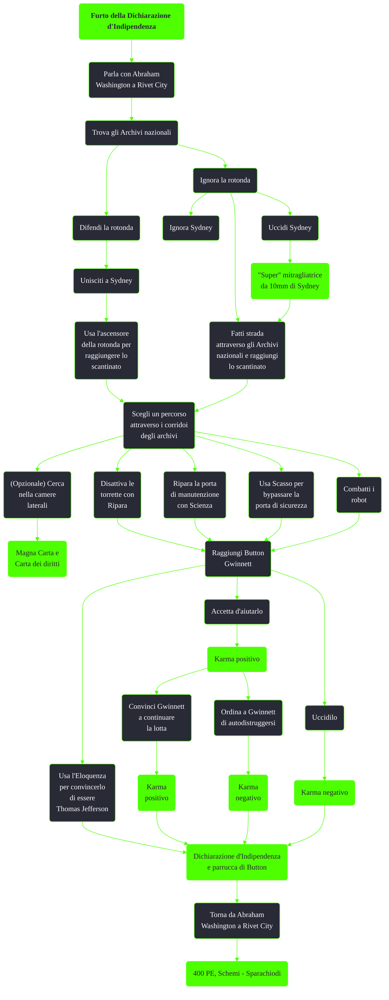

---
# Title, summary, and page position.
linktitle: Furto della Dichiarazione d'Indipendenza
summary: ""
weight: 10
icon: messages # message-question per le missioni nascoste
icon_pack: fas

# Page metadata.
title: Furto della Dichiarazione d'Indipendenza
date: 2022-11-15
type: book # Do not modify.
commentable: true
tags: "Missioni secondarie di Fallout 3"
hidden: true # Visibile nella sidebar
private: false # Nascosto dalle ricerche
---

*Furto della Dichiarazione d'Indipendenza* è una missione secondaria di Fallout 3. Si svolge tra Rivet City, gli Archivi nazionali e la biblioteca di Arlington, ed è data da Abraham Washington o Sydney.

| Tappe |       Stato        | Descrizione                                                        |
| :---: | :----------------: | ------------------------------------------------------------------ |
|  20   |                    | Recupera la Dichiarazione di Indipendenza dagli Archivi nazionali. |
|  30   |                    | Difendi la Rotonda                                                 |
|  50   |                    | (Facoltativo) Porta l'inchiostro a Button Gwinnett.                |
|  60   | :white_check_mark: | Torna da Abraham Washington a Rivet City.                          |

Note:
- Per disattivare le torrette è necessario Ripara 60, ma per poter accedere al generatore è necessario riparare la porta con Scienza 67
- Sydney non si comporta come un normale companion e la sua salute non si ripristinerà finita la battaglia ma bisognerà fornirle costantemente stimpak
    - Con il reverse-pickpocketing è possibile darle un'armatura più resistente
- E' possibile ottenere la "Super" mitragliatrice da 10mm di Sydney dandole a fine missione la nota "Una nota dal padre di Little Moonbeam"
  - La nota si trova al piano intermedio dello Statesman Hotel