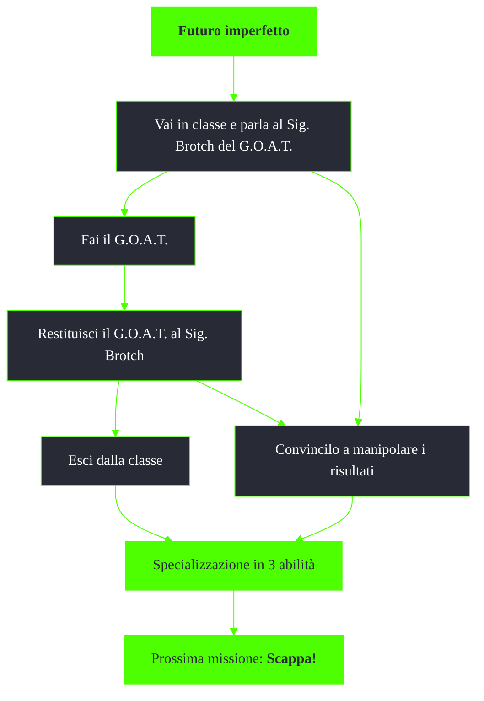

---
# Title, summary, and page position.
linktitle: Futuro imperfetto
summary: ""
weight: 10
icon: messages # message-question per le missioni nascoste
icon_pack: fas

# Page metadata.
title: Futuro imperfetto
date: 2022-11-15
type: book # Do not modify.
commentable: true
tags: "Missioni tutorial di Fallout 3"
hidden: true # Visibile nella sidebar
private: false # Nascosto dalle ricerche
---

*Futuro imperfetto* è la terza missione principale di Fallout 3. Si svolge nel Vault 101 ed è data da James.

| Tappe | Stato              | Descrizione                                       |
| :---: | :----------------: | ------------------------------------------------- |
|  10   |                    | Vai in classe e parla al Sig. Brotch del G.O.A.T. |
|  40   |                    | Siediti e prendi il G.O.A.T.                      |
|  70   |                    | Restituisci il G.O.A.T. al Sig. Brotch.           |
|  80   | :white_check_mark: | Esci dalla classe.                                |

Note:
- E' possibile bypassare il G.O.A.T. semplicemente dicendo al Sig. Brotch
- E' possibile cambiare le specialità poco prima di abbandonare il Vault nella missione successiva *Scappa!*