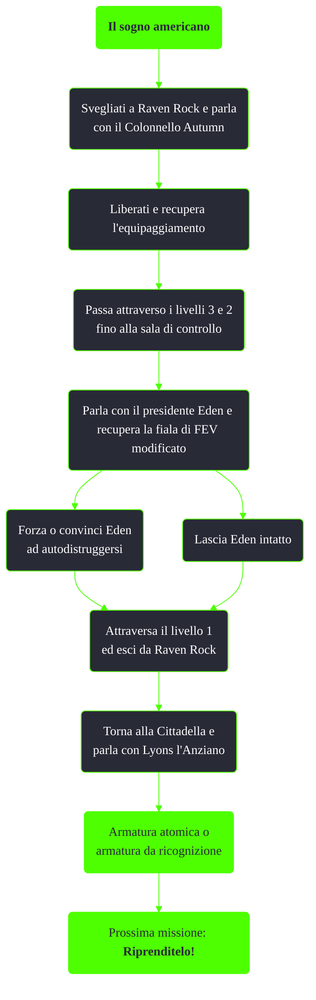

---
# Title, summary, and page position.
linktitle: Il sogno americano
summary: ""
weight: 40
icon: messages # message-question per le missioni nascoste
icon_pack: fas

# Page metadata.
title: Il sogno americano
date: 2022-11-15
type: book # Do not modify.
commentable: true
tags: "Missioni principali di Fallout 3"
hidden: true # Visibile nella sidebar
private: false # Nascosto dalle ricerche
---

*Il sogno americano* è l'undicesima missione principale di Fallout 3. Si svolge a Raven Rock ed è data dal Presidente Eden.

| Tappe |       Stato        | Descrizione                                      |
| :---: | :----------------: | ------------------------------------------------ |
|  10   |                    | Liberati dalla sedia.                            |
|  20   |                    | Recupera l'equipaggiamento dall'armadietto.      |
|  30   |                    | Incontra il presidente Eden nel suo ufficio.     |
|  40   |                    | Prendi la fiala di FEV modificato.               |
|  50   |                    | Fuggi dalla base dell'Enclave.                   |
|  60   | :white_check_mark: | Fai rapporto a Lyons l'Anziano  alla Cittadella. |

Note:
- La **Bambolina - Armi a energia** è nella stanza da letto del Colonnello Autumn; dopo questa missione risulterà inottenibile
- I companion non seguiranno il protagonista a Raven Rock, ma torneranno alle loro dimore
- Distruggere le torrette presidenziali farà guadagnare karma negativo