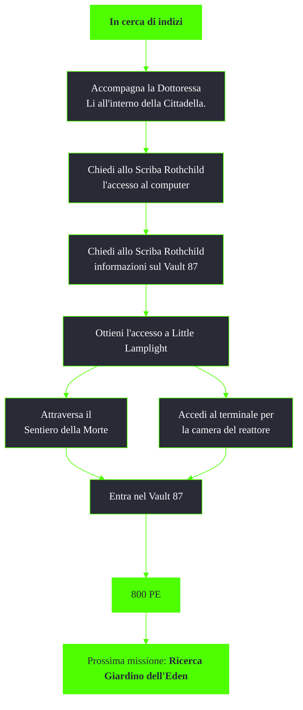

---
# Title, summary, and page position.
linktitle: In cerca di indizi
summary: ""
weight: 10
icon: messages # message-question per le missioni nascoste
icon_pack: fas

# Page metadata.
title: In cerca di indizi
date: 2022-11-15
type: book # Do not modify.
commentable: true
tags: "Missioni principali di Fallout 3"
hidden: true # Visibile nella sidebar
private: false # Nascosto dalle ricerche
---

*In cerca di indizi* è la nona missione principale di Fallout 3. Si svolge tra la Cittadella e Little Lamplight ed è data da Lyons l'Anziano.

| Tappe |       Stato        | Descrizione                                                                                          |
| :---: | :----------------: | ---------------------------------------------------------------------------------------------------- |
|   5   |                    | Accompagna la Dottoressa Li all'interno della Cittadella.                                            |
|  10   |                    | Chiedi allo Scriba Rothchild l'accesso al computer pre-bellico.                                      |
|  20   |                    | Usa il computer di Vault-Tec negli archivi della Cittadella per scoprire la posizione di un K.R.E.G. |
|  30   |                    | Chiedi allo Scriba Rothchild informazioni sul Vault 87.                                              |
|  40   |                    | Esplora le Caverne di Lamplight per trovare un accesso al Vault 87.                                  |
|  50   |                    | Ottieni l'accesso alla città di Little Lamplight.                                                    |
|  60   | :white_check_mark: | Entra nel Vault 87.                                                                                  |

Note:
- Con l'abilità extra Bambino dentro è possibile ottere immediato accesso a Little Lamplight e ssbloccare diversi dialoghi unici con i suoi abitanti
- Il Sentiero della Morte è abitato da diversi supermutanti
- Per ottenere l'accesso al terminale bisogna superare una sfida Scienza 50
- Usare il terminale mentre non è già attiva la missione potrebbe rendere impossibile completarla in seguito