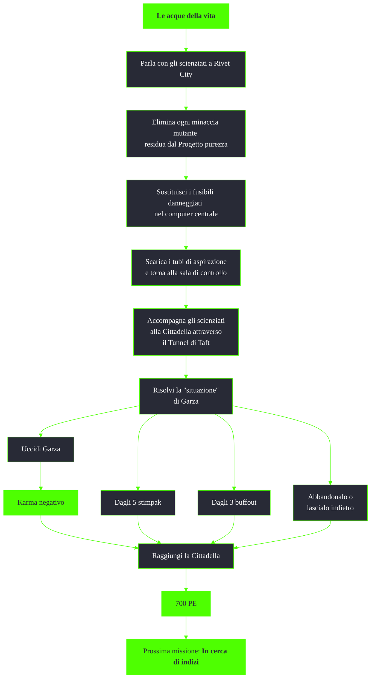

---
# Title, summary, and page position.
linktitle: Le acque della vita
summary: ""
weight: 10
icon: messages # message-question per le missioni nascoste
icon_pack: fas

# Page metadata.
title: Le acque della vita
date: 2022-11-15
type: book # Do not modify.
commentable: true
tags: "Missioni principali di Fallout 3"
hidden: true # Visibile nella sidebar
private: false # Nascosto dalle ricerche
---

*Le acque della vita* è l'ottava missione principale di Fallout 3. Si svolge tra il Jefferson Memorial e la Cittadella ed è data da James.

| Tappe |       Stato        | Descrizione                                                               |
| :---: | :----------------: | ------------------------------------------------------------------------- |
|  10   |                    | Vai al Laboratorio scientifico di Rivet City.                             |
|  20   |                    | Unisciti agli scienziati del Progetto purezza.                            |
|  25   |                    | Elimina ogni minaccia mutante residua dal Progetto purezza.               |
|  26   |                    | Informa papà che è sicuro accedere al Progetto purezza.                   |
|  27   |                    | Accompagna gli scienziati nel Progetto purezza.                           |
|  30   |                    | Attiva l'alimentazione della pompa di controllo inondazioni.              |
|  40   |                    | Procurati i fusibili da papà.                                             |
|  50   |                    | Sostituisci i fusibili danneggiati.                                       |
|  60   |                    | Avvia il computer centrale.                                               |
|  65   |                    | Parla con papà attraverso l'intercom.                                     |
|  70   |                    | Scarica i tubi di aspirazione.                                            |
|  75   |                    | Torna alla sala di controllo.                                             |
|  80   |                    | Accompagna la Dottoressa Li al punto di evacuazione.                      |
|  85   |                    | Accompagna la Dottoressa Li alla Cittadella attraverso il Tunnel di Taft. |
|  90   |                    | Risolvi la "situazione" di Garza.                                         |
|  100  | :white_check_mark: | Accompagna la Dottoressa Li alla Cittadella attraverso il Tunnel di Taft. |

Note:
- Uccidendo Garza con un'arma da fuoco la missione diverrà impossibile da completare
- Dopo aver completato la missione l'Enclave dispiegherà molti piu uomini nella Zona contaminata e sarà più facile imbattersi nei loro avamposti
- Con il DLC Broken Steel installato, nel tunnel potrebbero essere presenti diversi ghoul tecnologisti feroci
- Colpendo Garza per sbaglio, la Dottoressa Li si rifiuterà di continuare la missione
- Grazie questa missione sarà possibile ottenere l'addestramento per l'armatura atomica

