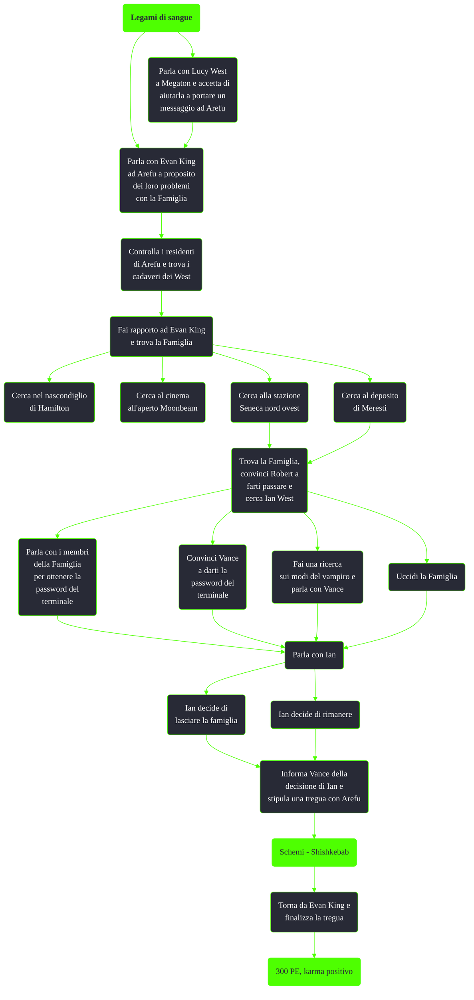

---
# Title, summary, and page position.
linktitle: Legami di sangue
summary: ""
weight: 10
icon: messages # message-question per le missioni nascoste
icon_pack: fas

# Page metadata.
title: Legami di sangue
date: 2022-11-15
type: book # Do not modify.
commentable: true
tags: "Missioni secondarie di Fallout 3"
hidden: true # Visibile nella sidebar
private: false # Nascosto dalle ricerche
---

*Legami di sangue* è una missione secondaria di Fallout 3. Si svolge tra Arefu e la stazione metropolitana di Meresti ed è data da Lucy West ed Evan King.

| Tappe |       Stato        | Descrizione                              |
| :---: | :----------------: | ---------------------------------------- |
|  10   |                    | Consegna il messaggio di Lucy.           |
|  15   |                    | Scopri cosa faceva la Famiglia ad Arefu. |
|  20   |                    | Controlla la Residenza West.             |
|  21   |                    | Controlla la Residenza Schenzy.          |
|  22   |                    | Controlla la Residenza Ewers.            |
|  25   |                    | Fai rapporto a Evan King.                |
|  30   |                    | Trova la Famiglia.                       |
|  40   |                    | Trova Ian West.                          |
|  50   |                    | Parla con Vance della decisione di Ian.  |
|  60   | :white_check_mark: | Torna da Evan King.                      |
| 65 |                    |     Torna da Vance per confermare l'accordo (se possibile)                                     |

Note:
- Se si va direttamente ad Arefu senza aver parlato prima con Lucy West a Megaton, più tardi potrebbe risultare impossibile convincere Ian a lasciare la Famiglia
- Se nella tregua si decide che Arefu venderà sacche si sangue in cambio di protezione, sarà possibile vendere a Vance le proprie sacche di sangue per 15 tappi ciascuna
- Se si  convince Ian a rimanere con la Famiglia tutte le opzioni di dialogo successive con Evan King saranno bugie ma non bloccheranno l'avanzamento della missione
- Uccidere un qualsiasi abitante di Arefu farà fallire la missione
- A causa di un bug se si uccidono tutti i membri della Famiglia dopo aver convinto Ian a tornare ad Arefu, gli abitanti di Arefu risulteranno ostili e non sarà possibile finire la missione. Questo perché una volta siglata la tregue la Famiglia e gli abitanti di Arefu risulteranno alleati nella stessa fazione
