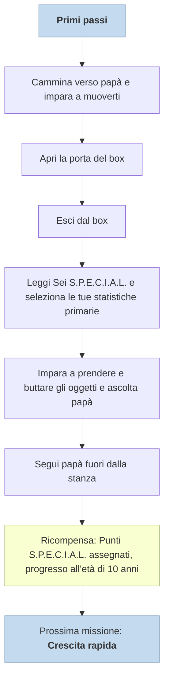

---
# Title, summary, and page position.
linktitle: Primi passi
summary: 'TODO'
weight: 40
icon: messages # message-question per le missioni nascoste
icon_pack: fas

# Page metadata.
title: Primi passi
date: 2022-11-15
type: book # Do not modify.
commentable: true
tags: "Missioni principali di Fallout 3"
hidden: true # Visibile nella sidebar
private: true # Nascosto dalle ricerche
---

Primi passi è la prima missione principale.

| Luogo/i   | Data da | Ricompensa                        | Sfide abilità | Prossima missione | Note |
| --------- | ------- | --------------------------------- | ------------- | ----------------- | ---- |
| Vault 101 | James   | Assegnamento punti S.P.E.C.I.A.L. | -             | [Crescita rapida](../crescita-rapida)                  |      |

| Tappe |       Stato        | Descrizione                       |
| :---: | :----------------: | --------------------------------- |
|  10   |                    | Vai da papà.                      |
|  20   |                    | Apri lo sportello della culla.    |
|  30   |                    | Esci dalla culla.                 |
|  40   |                    | Consulta il libro S.P.E.C.I.A.L.. |
|  80   | :white_check_mark: | Segui papà                        |
