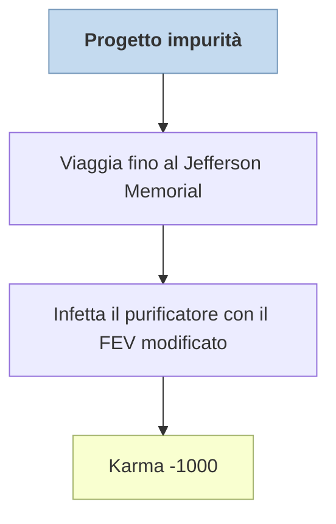

---
# Title, summary, and page position.
linktitle: Progetto impurità
summary: "TODO"
weight: 40
icon: messages # message-question per le missioni nascoste
icon_pack: fas

# Page metadata.
title: Progetto impurità
date: 2022-11-15
type: book # Do not modify.
commentable: true
tags: "Missioni principali di Fallout 3"
hidden: true # Visibile nella sidebar
private: false # Nascosto dalle ricerche
---

*Progetto impurità* è una missione principale del gioco. Si svolge al Jefferson Memorial ed è data dal presidente Eden. E' correlata con la missione *[Riprenditelo!](../riprenditelo)*

| Tappe | Stato              | Descrizione |
| :-----: | :------------------: | ----------- |
|   1    |                    |  Segui Liberty Prime mentre si fa strada verso il purificatore.           |
|   2    |                    | Raggiungi la sala di controllo del Progetto purezza.             |
|   3    |    :white_check_mark:                |    Infetta l'acqua del Progetto purezza... oppure no.         |

Note:
- E' possibile finire il gioco con un karma positivo anche se si infetta il purificatore, basta che il giocatore lo avvii personalmente (-1000 + +2000 karma)
- Se il giocatore dà la fiala a Lyons l'Anziano non sarà possibile infettare il purificatore