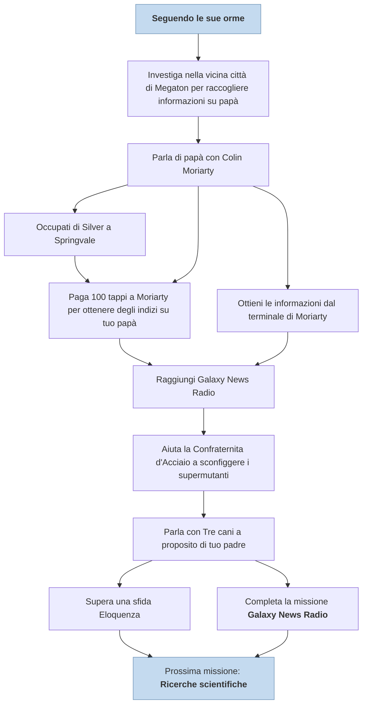

---
# Title, summary, and page position.
linktitle: Seguendo le sue orme
summary: "Seguendo le sue orme è la quinta missione principale del gioco. Si svolge fra il Vault 101, Megaton, la piazza dell'edificio GNR, Rivet City e Chevy Chase ed è data non appena terminata la missione Scappa!."
weight: 10
icon: messages # message-question per le missioni nascoste
icon_pack: fas

# Page metadata.
title: Seguendo le sue orme
date: 2022-11-15
type: book # Do not modify.
commentable: true
tags: "Missioni principali di Fallout 3"
hidden: true # Visibile nella sidebar
private: false # Nascosto dalle ricerche
---

*Seguendo le sue orme* è la quinta missione principale del gioco. Si svolge fra il Vault 101, Megaton, la piazza dell'edificio GNR, Rivet City e Chevy Chase ed è data non appena terminata la missione *Scappa!*.

| Tappe | Stato              | Descrizione                                                                   |
| :-----: | :------------------: | ----------------------------------------------------------------------------- |
| 10    |                    | Investiga nella vicina città di Megaton per raccogliere informazioni su papà. |
| 20    |                    | Parla di papà con Colin Moriarty.                                             |
| 25    |                    | (Facoltativo) Raggiungi un accordo con Silver a Springvale.                   |
| 30    |                    | Continua la tua ricerca di papà.                                              |
| 40    |                    | Trova Galaxy News Radio.                                                      |
| 60    |                    | Recupera il Fat Man dal soldato della Confraternita morto.                    |
| 65    |                    | Aiuta a sconfiggere il Supermutante Behemoth.                                 |
|  70     | :white_check_mark: | Chiedi a Tre cani informazioni su papà.                                       |

Note:
- E' possibile saltare questa missione andando direttamente a Rivet City e incontrando la Dottoressa Li
- E' possibile estorcere i tappi a Silver e poi ucciderla comunque, perdendo karma, ma raccogliendo in totale ben 500 tappi