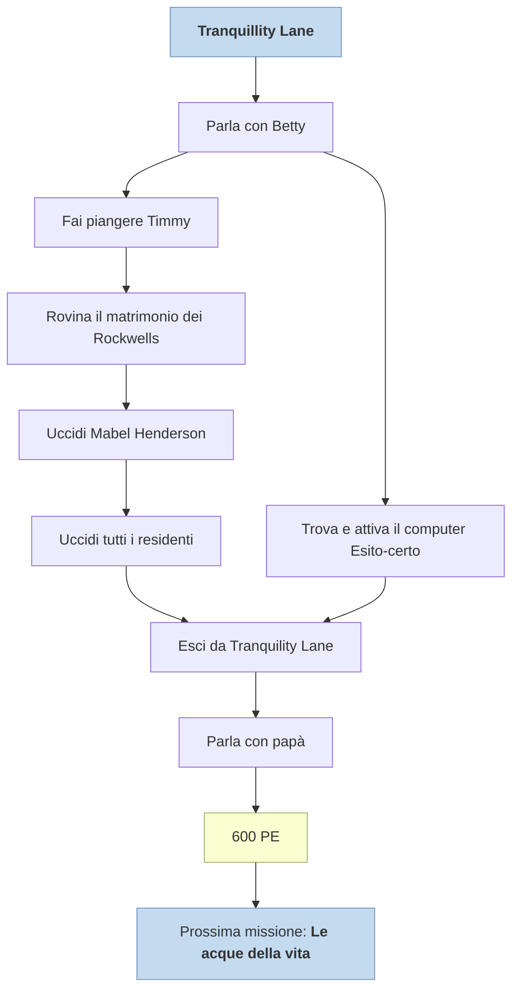

---
# Title, summary, and page position.
linktitle: Tranquillity Lane
summary: "Tranquillity Lane è la settima missione principale del gioco. Si svolge nel Vault 112 ed è data dal robocervello dell'omonimo vault."
weight: 10
icon: messages # message-question per le missioni nascoste
icon_pack: fas

# Page metadata.
title: Tranquillity Lane
date: 2022-11-15
type: book # Do not modify.
commentable: true
tags: "Missioni principali di Fallout 3"
hidden: true # Visibile nella sidebar
private: false # Nascosto dalle ricerche
---

*Tranquillity Lane* è la settima missione principale del gioco. Si svolge nel Vault 112 ed è data dal robocervello dell'omonimo vault. 

| Tappe |       Stato        | Descrizione                                                                         |
| :---: | :----------------: | ----------------------------------------------------------------------------------- |
|   5   |                    | Trova papà.                                                                         |
|  10   |                    | Trova Betty e parla con lei.                                                        |
|  15   |                    | Fai piangere Timmy Neusbaum.                                                        |
|  20   |                    | Fai un rapporto a Betty.                                                            |
|  25   |                    | Rovina il matrimonio dei Rockwells senza uccidere nessuno dei due.                  |
|  30   |                    | Fai un rapporto a Betty.                                                            |
|  32   |                    | (Facoltativo) Trova e attiva il computer Esito-certo di Tranquility Lane.           |
|  35   |                    | Organizza una morte creativa per Mabel Henderson.                                   |
|  40   |                    | Fai un rapporto a Betty.                                   |
|  45   |                    | Recupera la maschera e il coltello sul lato posteriore dell'Abitazione abbandonata. |
|  50   |                    | Uccidi tutti i residenti di Tranquility Lane.                                       |
|  60   |                    | Fai un rapporto a Betty.                                                            |
|  70   |                    | Esci da Tranquility Lane.                                                           |
|  75   | :white_check_mark: | Parla con papà.                                                                     |
|       |                    |                                                                                     |

Note:
- Il codice di esito-certo va composto nella casa abbandonata interagendo con (nell'ordine): 
	1. la radio rotta
	2. la brocca di vetro
	3. lo gnomo da giardino
	4. la brocca di vetro
	5. il blocco di cemento
	6. lo gnomo da giardino
	7. la bottiglia di soda vuota
