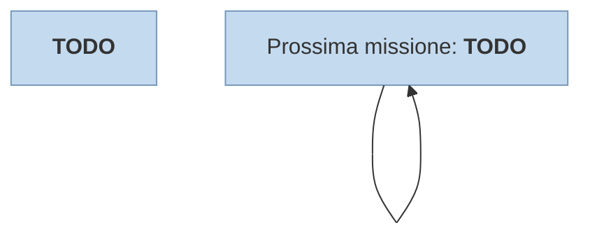

---
# Title, summary, and page position.
linktitle: 
summary: "TODO"
weight: 40
icon: messages # message-question per le missioni nascoste
icon_pack: fas

# Page metadata.
title: 
date: 2022-11-15
type: book # Do not modify.
commentable: true
tags: "Missioni secondarie di Fallout 3"
hidden: true # Visibile nella sidebar
private: true # Nascosto dalle ricerche
---

Breve descrizione

| Tappe | Stato              | Descrizione |
| :-----: | :------------------: | ----------- |
|       |                    |             |
|       |                    |             |
|       |                    |             |
|       |                    |             |
|       |                    |             |
|       |                    |             |
|       | :white_check_mark: |             |

Note:
- 