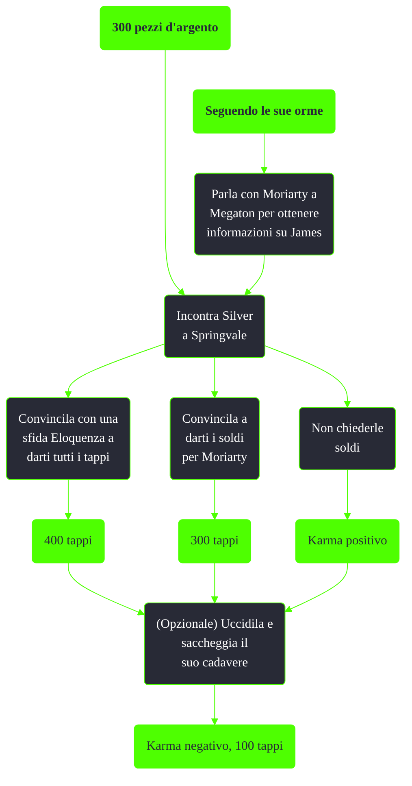

---
# Title, summary, and page position.
linktitle: 300 pezzi d'argento
summary: ""
weight: 10
icon: message-question
icon_pack: fas

# Page metadata.
title: 300 pezzi d'argento
date: 2022-11-15
type: book # Do not modify.
commentable: true
tags: "Missioni nascoste di Fallout 3"
hidden: true # Visibile nella sidebar
private: false # Nascosto dalle ricerche
---

*300 pezzi d'argento* è una missione nascosta di Fallout 3. È data da Silver a Springvale o da Moriarty a Megaton.

Note:
- Il cadavere di Silver avrà sempre 100 tappi, anche se, vincendo la sfida Eloquenza, le si estorcono tutti e 400 tappi
- Completare *Seguendo le sue orme* potrebbe rendere inottenibile la missione o impossibile da finire