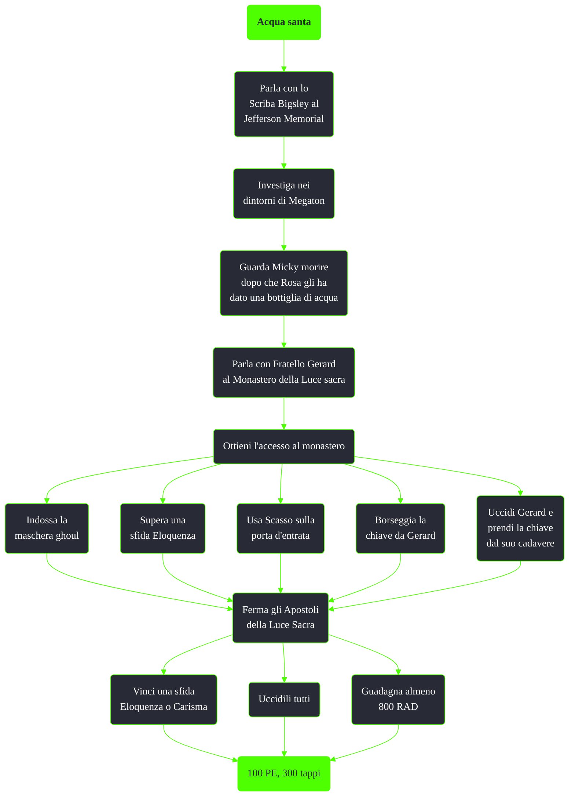

---
# Title, summary, and page position.
linktitle: Acqua santa
summary: ""
weight: 10
icon: message-question
icon_pack: fas

# Page metadata.
title: Acqua santa
date: 2022-11-15
type: book # Do not modify.
commentable: true
tags: "Missioni di Broken Steel"
hidden: true # Visibile nella sidebar
private: false # Nascosto dalle ricerche
---

*Acqua santa* è una missione nascosta del DLC *Broken Steel* di Fallout 3. È data dallo Scriba Bigsley al Jefferson Memorial.

| Tappe |       Stato        | Descrizione                                                                                    |
|:-----:|:------------------:| ---------------------------------------------------------------------------------------------- |
|  10   |                    | Perlustra l'area che circonda Megaton e fai il punto della situazione sulla storia dell'acqua. |
|  50   |                    | Chiedi informazioni sull'acqua santa al monastero della Luce eterna.                           |
|  55   |                    | Bevi l'acqua santa.                                                                            |
|  56   |                    | Parla con Fratello Gerard.                                                                     |
|  57   |                    | Cerca di entrare nel monastero.                                                                |
|  60   |                    | (Opzionale) Contamina il tuo corpo con le radiazioni ed entra nel monastero.                   |
|  100  |                    | Ferma gli Apostoli della Luce eterna.                                                          |
|  150  | :white_check_mark: | Fai rapporto a Bigsley.                                                                        |

Note:
- Nno è possibile accettare la missione se la Cittadella è stata distrutta durante *Chi osa vince*
