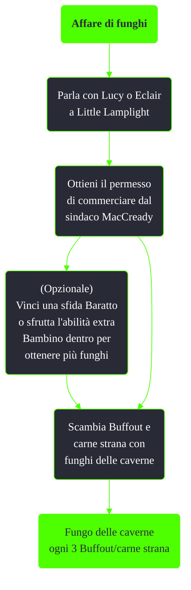

---
# Title, summary, and page position.
linktitle: Affare di funghi
summary: ""
weight: 10
icon: message-question
icon_pack: fas

# Page metadata.
title: Affare di funghi
date: 2022-11-15
type: book # Do not modify.
commentable: true
tags: "Missioni nascoste di Fallout 3"
hidden: true # Visibile nella sidebar
private: false # Nascosto dalle ricerche
---

*Affare di funghi* è una missione nascosta e ripetibile di Fallout 3. È data da Lucy o Eclair a Little Lamplight.

Note:
- 80 pezzi di carne strana possono essere trovati ad Andale
- È necessario avere karma neutro o positivo per poter iniziare questa missione
- I funghi delle caverne sono tra gli oggetti più costosi del gioco (50 tappi) e, assieme ai frutti di Punga, fra i pochi consumabili in grado di rimuovere le radiazioni dal giocatore