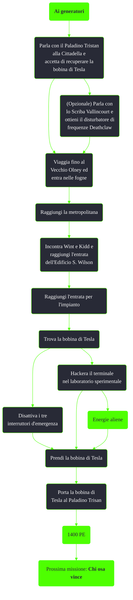

---
# Title, summary, and page position.
linktitle: Ai generatori
summary: ""
weight: 10
icon: message-question
icon_pack: fas

# Page metadata.
title: Ai generatori
date: 2022-11-15
type: book # Do not modify.
commentable: true
tags: "Missioni di Broken Steel"
hidden: true # Visibile nella sidebar
private: false # Nascosto dalle ricerche
---

*Ai generatori* è una missione del DLC *Broken Steel* di Fallout 3. È data dal Paladino Tristan alla Cittadella.

**Riassunto**:
1. Parla con il Paladino Tristan alla Cittadella e accetta di recuperare la bobina di Tesla
2. (Opzionale) Parla con lo Scriba Vallincourt e ottieni il disturbatore di frequenze Deathclaw
3. Viaggia fino al Vecchio Olney ed entra nelle fogne
4. Raggiungi la metropolitana
5. Incontra Wint e Kidd e raggiungi l'entrata dell'Edificio S. Wilson
6. Raggiungi l'entrata per l'impianto
7. Trova la bobina di Tesla
   - Disattiva i tre interruttori d'emergenza
   - Hackera il terminale nel laboratorio sperimentale
8. Prendi la bobina di Tesla
9. Porta la bobina di Tesla al Paladino Trisan 
10. Ricompensa: **1400 PE**
11. Prossima missione: *Chi osa vince*

<section class="chart-collapse">
<input type="checkbox" name="collapse2" id="handle2">
<h3 class="handle">
<label for="handle2">Clicca per mostrare il diagramma</label>
</h3>

</section>

| Tappe |       Stato        | Descrizione                                                                  |
|:-----:|:------------------:| ---------------------------------------------------------------------------- |
|  10   |                    | Parla con il Paladino Tristan.                                               |
|  20   |                    | Trova le rovine dell'Impianto di Olney.                                      |
|  30   |                    | Trova una bobina di Tesla.                                                   |
|  40   |                    | Consegna la bobina di Tesla al Paladino Tristan.                             |
|  50   | :white_check_mark: | Fai rapporto al Paladino Tristan per ricevere la prossima missione.          |
|  60   |                    | (Opzionale) Parla con la Scriba Vallincourt al laboratorio della Cittadella. |
|  61   |                    | (Opzionale) Usa i Deathclaw controllati dall'Enclave.                        |

