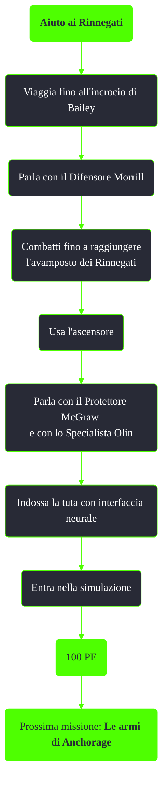

---
# Title, summary, and page position.
linktitle: Aiuto ai Rinnegati
summary: ""
weight: 10
icon: message-question
icon_pack: fas

# Page metadata.
title: Aiuto ai Rinnegati
date: 2022-11-15
type: book # Do not modify.
commentable: true
tags: "Missioni di Operation: Anchorage"
hidden: true # Visibile nella sidebar
private: false # Nascosto dalle ricerche
---

*Aiuto ai Rinnegati* è una missione del DLC *Operation: Anchorage* di Fallout 3. È data dal segnale di soccorso dei Rinnegati proveniente dall'incrocio di Bailey e si svolge all'interno dell'avamposto dei Rinnegati. 

**Riassunto**:
1. Viaggia fino all'incrocio di Bailey
2. Parla con il Difensore Morrill
3. Combatti fino a raggiungere l'avamposto dei Rinnegati
4. Usa l'ascensore
5. Parla con il Protettore McGraw e con lo Specialista Olin
6. Indossa la tuta con interfaccia neurale ed entra nella simulazione
7. Ricompensa: **100 PE**
8. Prossima missione: *Le armi di Anchorage*

<section class="chart-collapse">
<input type="checkbox" name="collapse2" id="handle2">
<h3 class="handle">
<label for="handle2">Clicca per mostrare il diagramma</label>
</h3>

</section>

| Tappe |       Stato        | Descrizione                                     |
| :---: | :----------------: | ----------------------------------------------- |
|  10   |                    | Indaga sulla comunicazione radio dei Rinnegati. |
|  15   |                    | Trova la base dei Rinnegati ed entraci.         |
|  20   |                    | Parla con il leader dei Rinnegati.              |
|  30   |                    | Esplora l'avamposto VSS.                        |
|  40   |                    | Segui Sibley nella stanza della simulazione.    |
|  45   |                    | Indossa la tuta con interfaccia neurale          |
|  50   | :white_check_mark: | Entra nel pod di simulazione.                   |

**Note**:
- Lottando a fianco dei Rinnegati contro le orde di supermutanti può capitare di colpire un Rinnegato per sbaglio e rendere tutti gli altri ostili
- Se i Rinnegati di Fort Independence sono già stati uccisi, quelli dell'avamposto diventeranno, dopo un breve confronto, subito ostili. Sarà comunque ancora possibile entrare indossare la tuta e entrare nella simulazione

