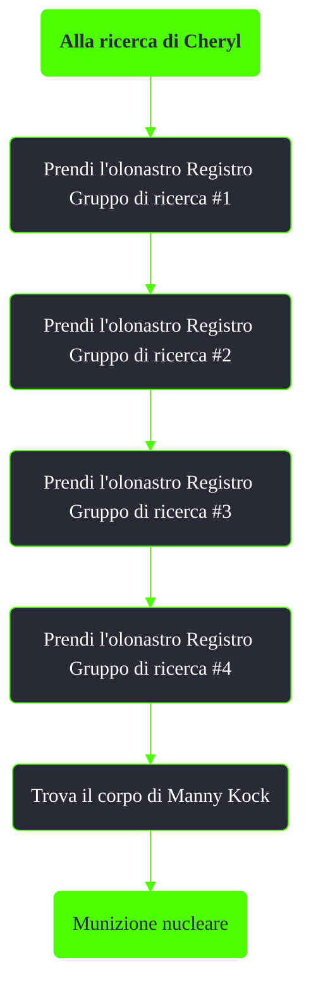

---
# Title, summary, and page position.
linktitle: Alla ricerca di Cheryl
summary: ""
weight: 10
icon: message-question
icon_pack: fas

# Page metadata.
title: Alla ricerca di Cheryl
date: 2022-11-15
type: book # Do not modify.
commentable: true
tags: "Missioni nascoste di Fallout 3"
hidden: true # Visibile nella sidebar
private: false # Nascosto dalle ricerche
---

*Alla ricerca di Cheryl* è una missione nascosta di Fallout 3. E' data consultando l'olonastro "Registro Gruppo di ricerca #1" che si può raccogliere in una tomba a L'Enfant Sud.

| Immagine | Oggetto e posizione |
| -------- | ------------------- |
|   | **Registro Gruppo di ricerca #1**, in una tomba a L'Enfant Sud  |
| TODO  |  **Registro Gruppo di ricerca #2**, in una terminale nell'area dei mercenari di Reilly. E' necessaria la password, recuperabile durante la missione *Mercenari di Reilly*, o con Scienza 100 |
|   |  **Registro Gruppo di ricerca #3**, in una tomba a nord del Potomac Bridge, a sud della casa di Dukov |
|  | **Registro Gruppo di ricerca #4**, in una tomba a sud-ovest della stazione metropolitana di Jury Street  |
|    | Il cadavere di Manny Kock, all'accampamento dei supermutanti a nord di Calverton  |

Note:
- Entrare nel container con i carrelli della spesa farà comparire un supermutante behemoth