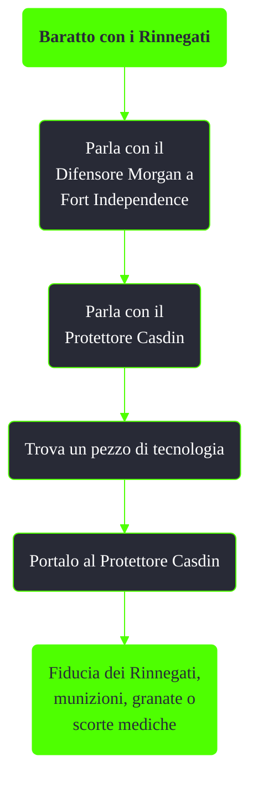

---
# Title, summary, and page position.
linktitle: Baratto con i Rinnegati
summary: ""
weight: 10
icon: message-question
icon_pack: fas

# Page metadata.
title: Baratto con i Rinnegati
date: 2022-11-15
type: book # Do not modify.
commentable: true
tags: "Missioni nascoste di Fallout 3"
hidden: true # Visibile nella sidebar
private: false # Nascosto dalle ricerche
---

*Baratto con i Rinnegati* è una missione nascosta e ripetibile di Fallout 3. È data dal Protettore Casdin a Fort Independence.

**Riassunto**:
1. Parla con il Difensore Morgan a Fort Independence
2. Parla con il Protettore Casdin
3. Trova un pezzo di tecnologia
4. Portalo al Protettore Casdin
5. Ricompensa: **munizioni**, **granate** o **scorte mediche**

<section class="chart-collapse">
<input type="checkbox" name="collapse2" id="handle2">
<h3 class="handle">
<label for="handle2">Clicca per mostrare il diagramma</label>
</h3>

</section>

**Note**:
- Fra gli oggetti che si possono scambiare: rottami di ferro (2 alla volta), moduli sensore, pistole laser, fucili laser, pistole al plasma, fucili al plasma, blaser alieno, munizioni aliene, armature atomiche, elmi atomici, armature atomiche dell'Enclave, elmi atomici dell'Enclave, armature Tesla
- Non sono accettate armi e armature uniche e quelle provenienti dai DLC
- Non viene presa in considerazione la condizione dell'oggetto
- Una volta ottenuta la fiducia dei Rinnegati, sarà possibile entrare a Fort Independence
  - Sarà ancora necessario forzare la serratura o rubare la chiave da Casdin
- Se si indossa un'armatura dei Rinnegati, questa verrà immediatamente confiscata a meno di non aver già ottenuto la fiducia dei Rinnegati

