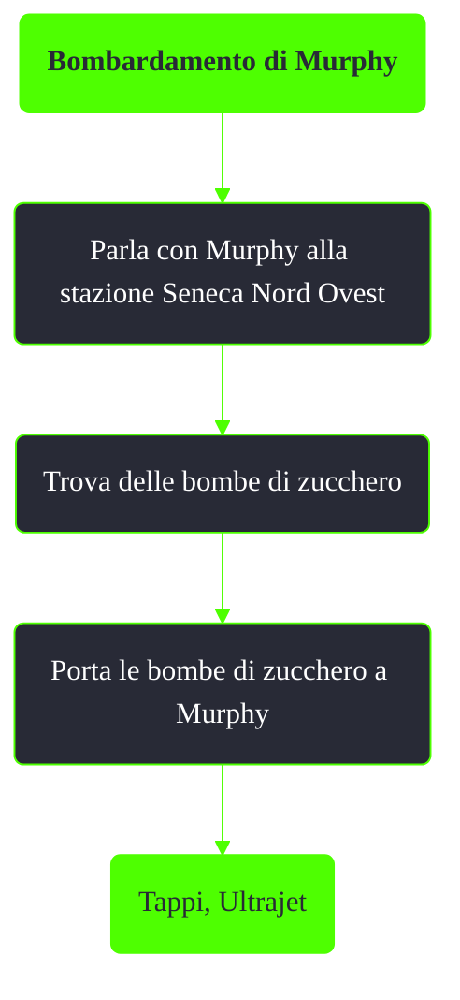

---
# Title, summary, and page position.
linktitle: Bombardamento di Murphy
summary: ""
weight: 10
icon: message-question
icon_pack: fas

# Page metadata.
title: Bombardamento di Murphy
date: 2022-11-15
type: book # Do not modify.
commentable: true
tags: "Missioni nascoste di Fallout 3"
hidden: true # Visibile nella sidebar
private: false # Nascosto dalle ricerche
---

*Bombardamento di Murphy* è una missione nascosta e ripetibile di Fallout 3. È data da Murphy alla stazione Seneca Nord Ovest.

<section class="chart-collapse">
<input type="checkbox" name="collapse2" id="handle2">
<h3 class="handle">
<label for="handle2">Clicca per mostrare il diagramma</label>
</h3>

</section>

**Note**:
- Dove trovare le bombe di zucchero in grandi quantità:
  - Cittadella: 6 scatole, nel laboratorio
  - Area campeggio nazionale Everglow: 11 scatole, nel camion a nord-ovest
  - Stazione metropolitana di Jury Street: 8 scatole nell'Alimentari Fiocco d'Oro
  - Mama Dolce: 11 scatole (4 nell'area distribuzione)
  - Megaton: 5 scatole; 11 comprando tutti i temi per la casa
  - Museo di Storia: 7 scatole
  - Stazione di Seneca Nord Ovest, al Cornucopia Fresh Groceries: 4 scatole
  - Rivet City: 4 scatole
  - Torre Tenpenny: 9 scatole

