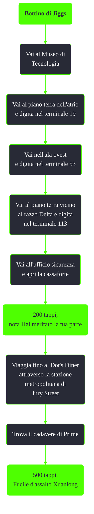

---
# Title, summary, and page position.
linktitle: Bottino di Jiggs
summary: ""
weight: 10
icon: message-question
icon_pack: fas

# Page metadata.
title: Bottino di Jiggs
date: 2022-11-15
type: book # Do not modify.
commentable: true
tags: "Missioni nascoste di Fallout 3"
hidden: true # Visibile nella sidebar
private: false # Nascosto dalle ricerche
---

*Bottino di Jiggs* è una missione nascosta di Fallout 3. È data da Prime attraverso i terminali del Museo di Tecnologia.

Note:
- Il numero del terminale dal quale si inizia la caccia al tesoro sarà "#000"; dopo aver letto la nota cambierà in "#001"
- Se si sbaglia a digitare il numero corretto anche una sola volta, sarà impossibile ottenere il bottino nella cassaforte e  il cadavere il Prime al Dot's Diner non comparirà