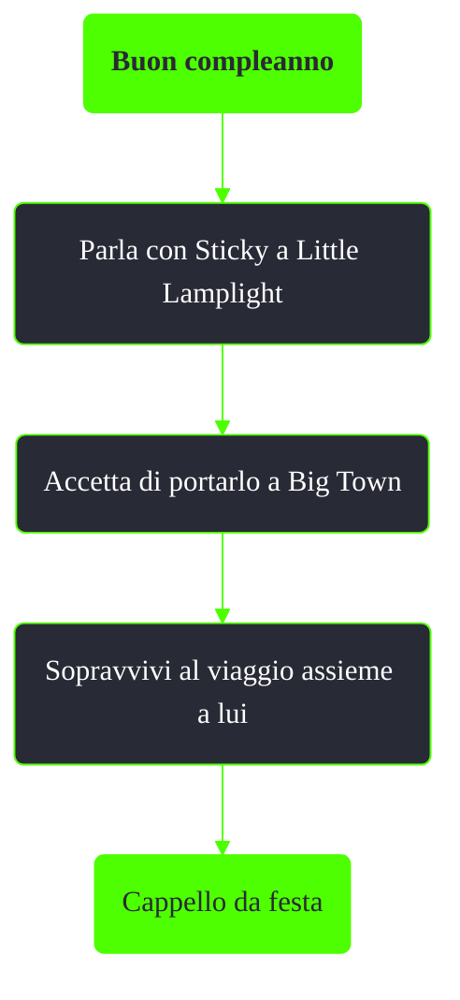

---
# Title, summary, and page position.
linktitle: Buon compleanno
summary: ""
weight: 10
icon: message-question
icon_pack: fas

# Page metadata.
title: Buon compleanno
date: 2022-11-15
type: book # Do not modify.
commentable: true
tags: "Missioni nascoste di Fallout 3"
hidden: true # Visibile nella sidebar
private: false # Nascosto dalle ricerche
---

*Buon compleanno* è una missione nascosta di Fallout 3. È data da Sticky a Little Lamplight.

**Riassunto**:
1. Parla con Sticky a Little Lamplight
2. Accetta di portarlo a Big Town
3. Sopravvivi al viaggio assieme a lui
4. Ricompensa: **Cappello da festa**

<section class="chart-collapse">
<input type="checkbox" name="collapse2" id="handle2">
<h3 class="handle">
<label for="handle2">Clicca per mostrare il diagramma</label>
</h3>

</section>

**Note**:
- Fintanto che Sticky non raggiunge Big Town, potrà essere usato come companion temporaneo
- Se è già stata terminata la missione *Grossi problemi a Big Town*, bisogna dare particolare attenzione alle mine rimaste perché potrebbero uccidere Sticky

