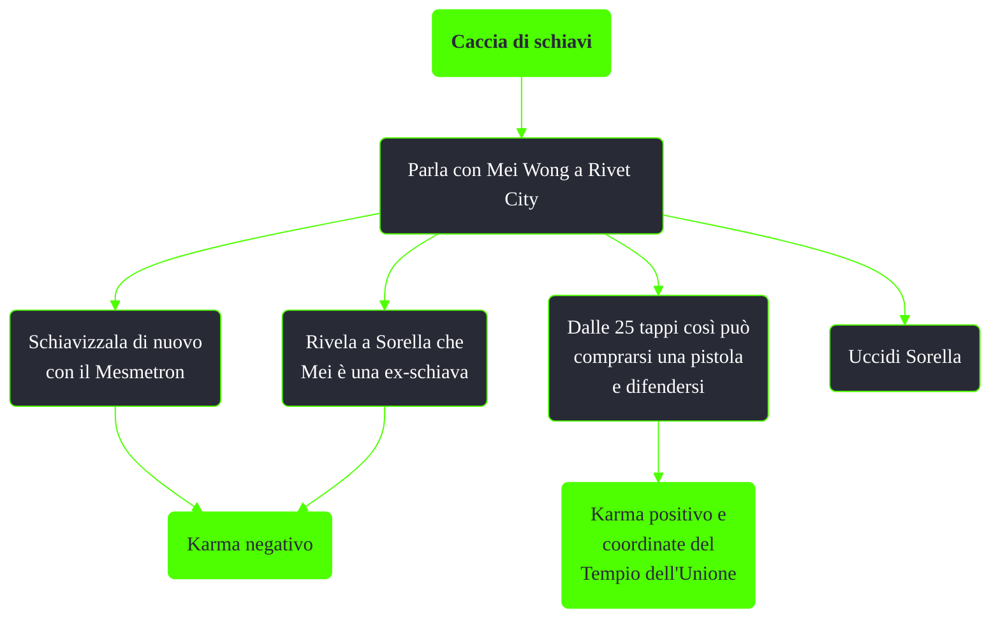

---
# Title, summary, and page position.
linktitle: Caccia di schiavi
summary: ""
weight: 10
icon: message-question
icon_pack: fas

# Page metadata.
title: Caccia di schiavi
date: 2022-11-15
type: book # Do not modify.
commentable: true
tags: "Missioni nascoste di Fallout 3"
hidden: true # Visibile nella sidebar
private: false # Nascosto dalle ricerche
---

*Caccia di schiavi* è una missione nascosta di Fallout 3. È data da Mei Wong a Rivet City.

**Riassunto**:
1. Parla con Mei Wong a Rivet City
   - Schiavizzala di nuovo con il Mesmetron: **karma negativo**
   - Rivela a Sorella che Mei è una ex-schiava: **karma negativo**
   - Dalle 25 tappi così può comprarsi una pistola e difendersi: **karma positivo** e coordinate del Tempio dell'Unione
   - Uccidi Sorella: **nessuna ricompensa**

<section class="chart-collapse">
<input type="checkbox" name="collapse2" id="handle2">
<h3 class="handle">
<label for="handle2">Clicca per mostrare il diagramma</label>
</h3>

</section>

**Note**:
- Rivelando a Sorella che Mei è un'ex schiava, questa si suiciderà

