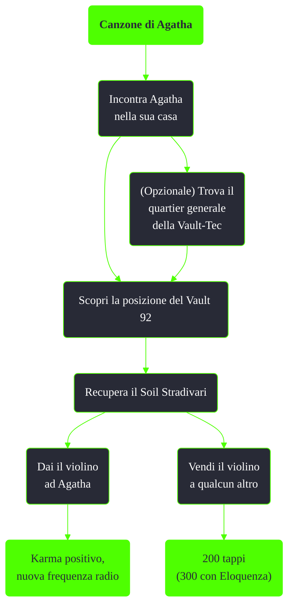

---
# Title, summary, and page position.
linktitle: Canzone di Agatha
summary: ""
weight: 10
icon: messages # message-question per le missioni nascoste
icon_pack: fas

# Page metadata.
title: Canzone di Agatha
date: 2022-11-15
type: book # Do not modify.
commentable: true
tags: "Missioni secondarie di Fallout 3"
hidden: true # Visibile nella sidebar
private: false # Nascosto dalle ricerche
---

*Canzone di Agatha* è una missione secondaria di Fallout 3. E' data da Agatha alla casa di Agatha.

| Tappe |       Stato        | Descrizione                                          |
| :---: | :----------------: | ---------------------------------------------------- |
|  10   |                    | Recupera il Soil Stradivari dal Vault 92.            |
|  20   |                    | (Facoltativo) Trova il Quartier generale Vault-Tec . |
|  30   |                    | (Facoltativo) Scopri la posizione del Vault 92.      |
|  50   | :white_check_mark: | Torna da Agatha.                                     |
|  60   | :white_check_mark: | Trova un acquirente per il Soil Stradivari.          |

Note:
- Sei si è scortesi con Agatha non sarà possibile ottenere la missione
- E' possibile chiedere ad Agatha la chiave della scatola di munizioni proprio all'inizio della missione
- E' possibile vendere il Soil Stradivari ad Ahrukhal, agli Inferi, o ad Abraham Washington, a Rivet City
- Dopo averlo venduto anche se si ricompra il Soil Stradivari la missione non permetterà di consegnarlo ad Agatha
- Vendere il violino, anche se non si ha mai interagito con Agatha, la renderà furiosa e la missione non sarà più ottenibile