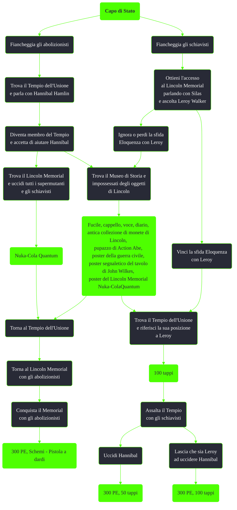

---
# Title, summary, and page position.
linktitle: Capo di Stato
summary: ""
weight: 10
icon: messages # message-question per le missioni nascoste
icon_pack: fas

# Page metadata.
title: Capo di Stato
date: 2022-11-15
type: book # Do not modify.
commentable: true
tags: "Missioni secondarie di Fallout 3"
hidden: true # Visibile nella sidebar
private: false # Nascosto dalle ricerche
---

*Capo di Stato* è una missione secondaria di Fallout 3. È data da Hannibal Hamlin al Tempio dell'Unione e da Leroy Walker al Lincoln Memorial.

| Tappe |       Stato        | Descrizione                                                    |
| :---: | :----------------: | -------------------------------------------------------------- |
|   5   |                    | Parla con Caleb Smith.                                         |
|  10   |                    | Assicurati che il Lincoln Memorial sia libero da Supermutanti. |
|  15   |                    | Uccidi tutti gli schiavisti vicino al Lincoln Memorial.        |
|  20   |                    | Procurati una foto del Lincoln Memorial.                       |
|  25   |                    | Porta la foto del Lincoln Memorial a Caleb.                    |
|  30   |                    | Incontra Hannibal al Monumento.                                |
|  35   |                    | Avvisa Hannibal che Monumento è libero da Supermutanti.        |
|  40   |                    | Avvisa Hannibal che Caleb è pronto.                            |
|  45   |                    | Trova almeno un manufatto Lincoln nel Museo di Storia.         |
|  50   |                    | Vendi i manufatti Lincoln a Leroy Walker                       |
|  55   |                    | Trova Hannibal Hamlin e il Tempio dell'Unione.                 |
|  60   |                    | Riferisci la posizione di Hannibal Hamlin a Leroy Walker       |
|  70   |                    | Unisciti a Leroy Walker per attaccare il Tempio dell'Unione.   |
|  80   |                    | Parla con Hannibal Hamlin.                                     |
|  90   |                    | Parla con Leroy Walker.                                        |
|  100  | :white_check_mark: | Trova gli schiavi fuggitivi.                                   |

Note:
- Se casualmente dei mercenari della Compagnia dell'Artiglio dovessero uccidere Hannibal, sarà impossibile completare la missione
- Dopo aver completato la missione in favore di Hannibal, sarà impossibile parlare con gli altri schiavi
- Tutti gli oggetti nella stanza di manutenzione sotto il Lincoln Memorial possono essere presi senza perdere karma
- Uccidere gli schiavisti al Lincoln Memorial non renderà ostili quelli a Paradise Falls. Tuttavia se gli schiavisti di Paradise Falls sono già stati uccisi, quelli al Lincoln Memorial saranno ostili
- Se l'Enclave ha già preso possesso del Jefferson Memorial, sarà impossibile completare la missione poiché saranno presenti delle barriere laser lungo il percorso della carovana
- Se si parla prima con Leroy senza sapere del Tempio dell'Unione, la missione consisterà nel trovare gli schiavi in fuga, se si ha intenzione di uccidere gli schiavisti. Si può semplicemente andare da Hannibal, quindi parlare con Caleb
- Alcuni soldati dell'Enclave potrebbero comparire lungo la strada degli schiavisti. Nel conflitto gli schiavisti potrebbero diventare ostili al giocatore