---
# Title, summary, and page position.
linktitle: Chi osa vince
summary: ""
weight: 10
icon: message-question
icon_pack: fas

# Page metadata.
title: Chi osa vince
date: 2022-11-15
type: book # Do not modify.
commentable: true
tags: "Missioni di Broken Steel"
hidden: true # Visibile nella sidebar
private: false # Nascosto dalle ricerche
---

*Chi osa vince* è una missione del DLC *Broken Steel* di Fallout 3. È data dal Paladino Tristan alla piazza della Casa Bianca <!--TODO-->.

<section class="chart-collapse">
<input type="checkbox" name="collapse2" id="handle2">
<h3 class="handle">
<label for="handle2">Clicca per mostrare il diagramma</label>
</h3>

</section>

```mermaid
%%{init: {'theme': 'base', 'themeVariables': { 'primaryColor': '#282a36', 'primaryBorderColor': '#4eff01', 'primaryTextColor': '#fff', 'lineColor': '#4eff01', 'fontFamily': 'Jura'}}}%%
graph TD;
    id1(<b>Chi osa vince</b>):::questfo3
    id2(Localizza ed entra <br />nel tunnel centrale da <br />Pennsylvania Avenue)
    id3(Raggiungi la il <br />sottolivello metro e <br />trova M.A.R.Go.T.)
    id4(Ignora M.A.R.Go.T. <br />e usa Scasso <br />per entrare nella<br /> metropolitana <br />presidenziale)
    id5(Fatti strada nella base)
    id6(Con una sfida Eloquenza <br />convinci M.A.R.Go.T. che <br />fai parte dell'esercito <br />americano)
    id7(Con una sfida Scienza <br />sovrascrivi i parametri di <br />sicurezza di M.A.R.Go.T.) 
    id8(Usa l'ID dipendente <br />del Senato)
    id9(Fallisci <br />l'identificazione)
    id10(Ottieni l'accesso)
    id11(M.A.R.Go.T. ti <br />considera ostile)

    id13(M.A.R.Go.T. ti <br />considera amichevole) 
    id14(Entra nella metropolitana <br />presidenziale e affronta <br />il robot sentinella)
    id15(Sbarazzati del robot <br />sentinella e ottieni il <br />fusibile principale)
    id16(Uccidi tutti i ghoul <br />e lascia che il robot <br />sentinella attivi il <br />sistema d'alimentazione)
    id17(Con la metro raggiungi <br />la Base aeronautica Adams)
    id18(Uccidi le <br />sentinelle)

    id20(Raggira le sentinelle <br />furtivamente)
    id21(Raggiungi la <br />Base aeronautica Adams <br />e recupera gli ordini e <br />l'equipaggiamento dalla <br />cassa di rifornimenti)
    id22(Trova il terminale di <br />accesso nella torre di <br />controllo e abbassa la <br />rampa sulla piattaforma <br />mobile)
    id23(Localizza ed entra <br />nel cingolato della <br />base mobile)
    id24(Entra nella base e <br />cerca un modo per <br />raggiungere il livello<br /> superiore)
    id25(Con Scienza spegni il <br />campo a impulsi)
    id26(Con Esplosivi <br />fai saltare il <br />campo a impulsi)
    id27(Distruggi il <br />campo a impulsi)
    id28(Incontra Stiggs)
    id29(Incontra la Squadra Sigma)
    id30(Parlaci)
    id31(Uccidi Stiggs, <br />Sparks e Hoover)
    id32(Sbarazzati della <br />Squadra Sigma)
    id33(Con Scasso disattiva <br />il campo a impulsi e <br />raggiungi l'armeria)
    id34(Ottieni l'accesso <br />al mainframe)
    id35(Con Scienza hackera il <br />terminale d'accesso)
    id36(Con Scasso forza <br />l'entrata)
    id37(Usa la chiave ottenuta <br />dall'ufficiale dell'Enclave)
    id38(Accedi al terminale <br />di sicurezza)
    id39(Con Scienza accedi <br />al controllo dei robot)
    id40(Sblocca tutte le <br />porte e l'armeria)
    id41(Disattiva i robot)
    id42(Con Esperto in robotica <br />fai in modo che i <br />robot attacchino i <br />soldati Enclave)
    id43(Esci per la rampa <br />di lancio e individua la <br />torre di controllo del<br /> satellite)
    id44(Entra nella torre di <br />controllo del satellite e <br />individua la sala <br />di controllo)
    id45(Accedi al terminale <br />di comunicazione)
    id46(Accedi al terminale <br />di controllo di sicurezza <br />e sblocca le porte)
    id47(Accedi al terminale <br />di collegamento satellitare)
    id48(Colpisci la Cittadella)
    id49(Colpisci la Base <br />aeronautica Adams)
    id50(Karma negativo):::rewardfo3
    id51(Karma positivo):::rewardfo3
    id52(Raggiungi l'armeria della <br />Base aeronautica Adams)

    id62(1500 PE, <br />Laser Gatling di precisione, <br />Blaster alieno, <br />munizioni e scorte):::rewardfo3
    id56(Entra nell'armeria <br />della Cittadella)
    id57(Magnum di Callahan, <br />armi e munizioni):::rewardfo3
    id58(Vai al laboratorio della <br />Cittadella e raggiungi <br />la testa di Liberty Prime)
    id59(Cannone Tesla):::rewardfo3
    id60(Prossima missione: <br /><b>Riparare Prime</b>):::questfo3
    id61(Prossima missione: <br /><b>Confraternita di sangue</b>):::questfo3
    id55(Esci dalla torre di controllo <br />satellitare ed entra <br />nel verti-bird)
    id1-->id2-->id3-->id6 & id7 & id8
    id3--->id4
    id4-->id11
    id3--->id9
    id8 & id6 & id7-->id10-->id13
    id9-->id11
    id11 & id13-->id14-->id15 & id16-->id17-->id18 &  id20-->id21-->id22-->id23-->id24
    id24-->id25 & id26 & id27-->id5-->id28 & id29
    id28-->id30 & id31
    id29-->id32 & id33
    id30 & id31 & id32 & id33-->id34-->id35 & id36-->id39
    id34-->id37-->id38
    id38-->id40
    id39-->id41 & id42
    id40 & id41 & id42-->id43-->id44-->id45 & id46-->id47-->id48 & id49
    id48-->id50
    id49-->id51
    id50 & id51-->id52-->id62-->id55
    id55-->id56-->id57
    id55-->id58-->id59-->id60 & id61
    
    
    
    
    
    classDef rewardfo3 fill:#4eff01, stroke:#4eff01, color:#282a36;
    classDef questfo3 fill:#4eff01, stroke:#4eff01, color:#282a36;
```

| Tappe |       Stato        | Descrizione                                                                      |
|:-----:|:------------------:| -------------------------------------------------------------------------------- |
|  10   |                    | Entra nella metropolitana presidenziale.                                         |
|  20   |                    | Individua l'uscita nella base aeronautica Adams.                                 |
|  25   |                    | (Opzionale) Risolvi la violazione di sicurezza alla metropolitana presidenziale. |
|  30   |                    | Vai a recuperare gli ordini e l'equipaggiamento dalla cassa di rifornimenti.     |
|  40   |                    | Trova il terminale di accesso per abbassare la rampa sulla piattaforma mobile.   |
|  50   |                    | Entra nella piattaforma mobile dell'Enclave.                                     |
|  60   |                    | Attiva i comandi di lancio del satellite orbitale.                               |
|  70   |                    | Fuggi dalla piattaforma mobile dell'Enclave.                                     |
|  80   | :white_check_mark: | Sali a bordo del Vertibird conquistato.                                          |

