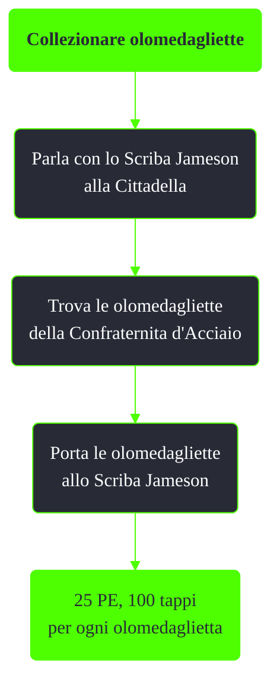

---
# Title, summary, and page position.
linktitle: Collezionare olomedagliette
summary: ""
weight: 10
icon: message-question
icon_pack: fas

# Page metadata.
title: Collezionare olomedagliette
date: 2022-11-15
type: book # Do not modify.
commentable: true
tags: "Missioni nascoste di Fallout 3"
hidden: true # Visibile nella sidebar
private: false # Nascosto dalle ricerche
---

*Collezionare olomedagliette* è una missione nascosta e ripetibile di Fallout 3. È data dallo Scriba Jameson alla Cittadella.

