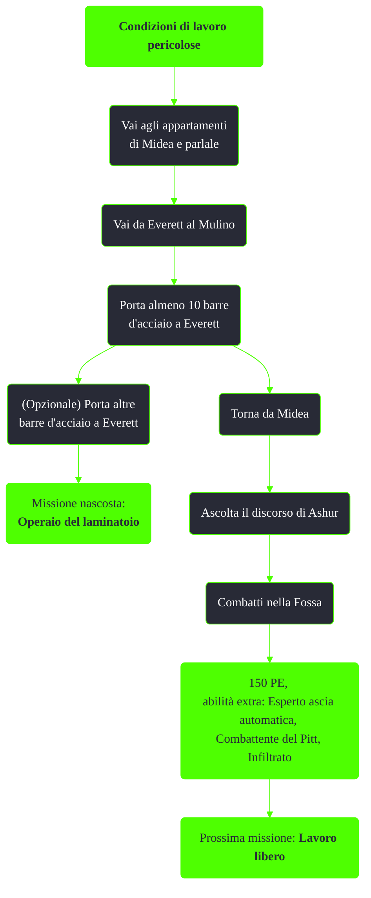

---
# Title, summary, and page position.
linktitle: Condizioni di lavoro pericolose
summary: ""
weight: 10
icon: message-question
icon_pack: fas

# Page metadata.
title: Condizioni di lavoro pericolose
date: 2022-11-15
type: book # Do not modify.
commentable: true
tags: "Missioni del Pitt"
hidden: true # Visibile nella sidebar
private: false # Nascosto dalle ricerche
---

*Condizioni di lavoro pericolose* è una missione del DLC *The Pitt* di Fallout 3. È data da Midea alla periferia del Pitt.

**Riassunto**:
1. Vai agli appartamenti di Midea e parlale
2. Vai da Everett al Mulino
3. Porta almeno 10 barre d'acciaio a Everett
4. (Opzionale) Porta altre barre d'acciaio a Everett: *Operaio del laminatoio*
5. Torna da Midea
6. Ascolta il discorso di Ashur
7. Combatti nella Fossa
8. Ricompensa: **150 PE**, **Esperto ascia automatica**, **Combattente del Pitt**, **Infiltrato**
9. Prossima missione: *Lavoro libero*

<section class="chart-collapse">
<input type="checkbox" name="collapse2" id="handle2">
<h3 class="handle">
<label for="handle2">Clicca per mostrare il diagramma</label>
</h3>

</section>

| Tappe |       Stato        | Descrizione                                            |
|:-----:|:------------------:| ------------------------------------------------------ |
|  10   |                    | Contatta Midea.                                        |
|  15   |                    | Incontra Midea in privato.                             |
|  49   |                    | (Opzionale) Vai da Marco a prendere un'arma.           |
|  50   |                    | Raccogli 10 sbarre dalla stadera.                      |
|  75   |                    | Torna da Midea.                                        |
|  100  |                    | Ascolta il discorso di Ashur.                          |
|  120  |                    | Iscriviti al combattimento nell'Arena.                 |
|  124  |                    | (Opzionale) Preparati per il combattimento nell'Arena. |
|  125  |                    | Entra nella Fossa.                                     |
|  130  |                    | Sconfiggi il tuo avversario.                           |
|  135  |                    | Lascia la Fossa.                                       |
|  139  |                    | (Opzionale) Preparati per il secondo combattimento.    |
|  140  |                    | Entra nella Fossa.                                     |
|  145  |                    | Sconfiggi i tuoi avversari.                            |
|  150  |                    | Lascia la Fossa.                                       |
|  159  |                    | (Opzionale) Preparati per il combattimento finale.     |
|  160  |                    | Entra nella Fossa.                                     |
|  165  |                    | Sconfiggi il tuo avversario..                          |
|  170  | :white_check_mark: | Lascia la Fossa.                                       |

**Note**:
- Per localizzare le bare d'acciaio consultare la voce della missione nascosta *Operaio del laminatoio* 

