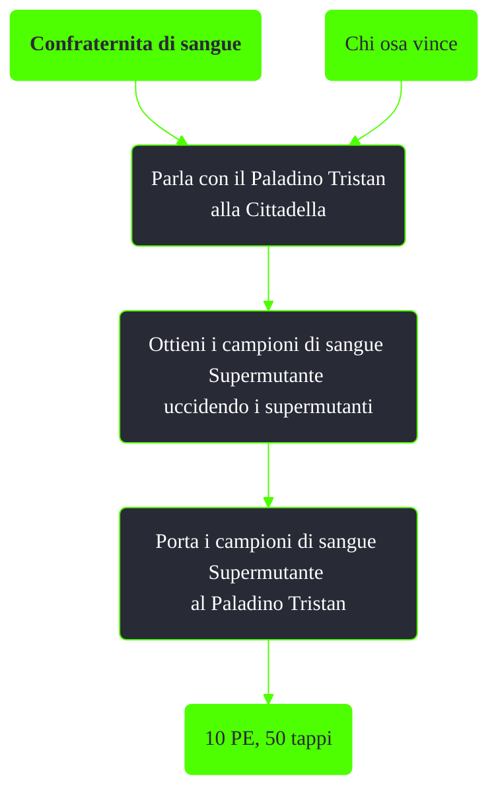

---
# Title, summary, and page position.
linktitle: Confraternita di sangue
summary: ""
weight: 10
icon: message-question
icon_pack: fas

# Page metadata.
title: Confraternita di sangue
date: 2022-11-15
type: book # Do not modify.
commentable: true
tags: "Missioni di Broken Steel"
hidden: true # Visibile nella sidebar
private: false # Nascosto dalle ricerche
---

*Confraternita di sangue* è una missione del DLC *Broken Steel* di Fallout 3. È data dal Paladino Tristan alla Cittadella.

<section class="chart-collapse">
<input type="checkbox" name="collapse2" id="handle2">
<h3 class="handle">
<label for="handle2">Clicca per mostrare il diagramma</label>
</h3>

</section>

**Note**:
- Se la Cittadella è stata distrutta durante *Chi osa vince*, non sarà possibile ottenere questa missione
- Vista l'enorme mole di supermutanti, è consigliabile iniziare *Confraternita di sangue* prima della missione *Mercenari di Reilly*
- I supermutanti Behemoth non hanno campioni di sangue

