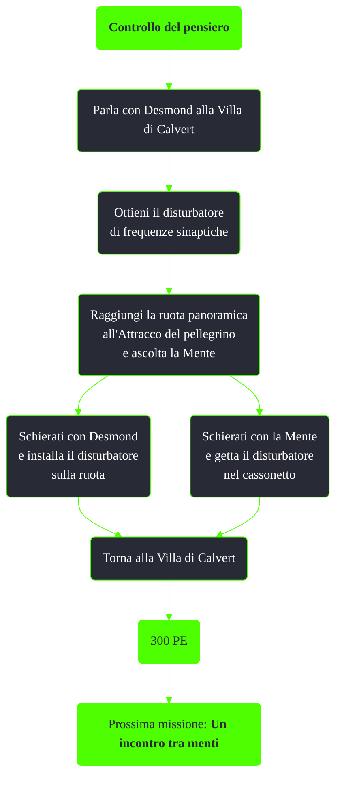

---
# Title, summary, and page position.
linktitle: Controllo del pensiero
summary: ""
weight: 10
icon: message-question
icon_pack: fas

# Page metadata.
title: Controllo del pensiero
date: 2022-11-15
type: book # Do not modify.
commentable: true
tags: "Missioni di Point Lookout"
hidden: true # Visibile nella sidebar
private: false # Nascosto dalle ricerche
---

*Controllo del pensiero* è una missione del DLC *Point Lookout* di Fallout 3. È data da Desmond alla Villa di Calvert.

| Tappe |       Stato        | Descrizione                                                                                                                |
|:-----:|:------------------:| -------------------------------------------------------------------------------------------------------------------------- |
|  10   |                    | Parla con Desmond.                                                                                                         |
|  20   |                    | Installa il disturbatore di frequenze sinaptiche sulla ruota panoramica                                                    |
|  21   |                    | Usa la pressa dei rifiuti per distruggere il disturbatore di frequenza sinaptiche.                                         |
|  25   |                    | Installa il disturbatore di frequenze sinaptiche sulla ruota panoramica OPPURE usa la pressa dei rifiuti per distruggerlo. |
|  50   |                    | Avvia la ruota panoramica.                                                                                                 |
|  100  | :white_check_mark: | Torna alla villa.                                                                                                          |

