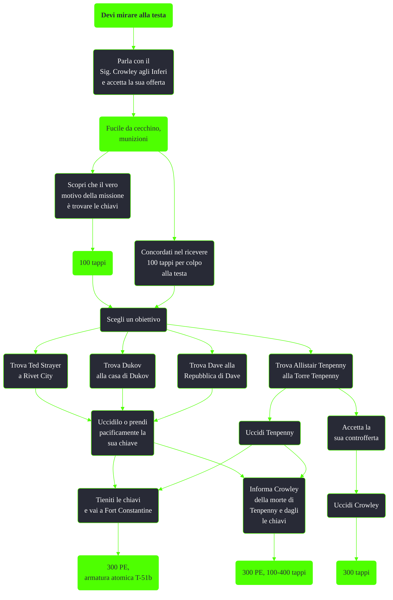

---
# Title, summary, and page position.
linktitle: Devi mirare alla testa
summary: ""
weight: 10
icon: messages # message-question per le missioni nascoste
icon_pack: fas

# Page metadata.
title: Devi mirare alla testa
date: 2022-11-15
type: book # Do not modify.
commentable: true
tags: "Missioni secondarie di Fallout 3"
hidden: true # Visibile nella sidebar
private: false # Nascosto dalle ricerche
---

*Devi mirare alla testa* è una missione secondaria di Fallout 3. È data dal Sig. Crowley agli Inferi.

<section class="chart-collapse">
<input type="checkbox" name="collapse2" id="handle2">
<h3 class="handle">
<label for="handle2">Clicca per mostrare il diagramma</label>
</h3>

</section>

| Tappe |       Stato        | Descrizione                                              |
| :---: | :----------------: | -------------------------------------------------------- |
|  10   |                    | Uccidi Allistair Tenpenny                                |
|  20   |                    | Uccidi Dukov e prendi la sua chiave.                     |
|  25   |                    | Trova la chiave di Dukov.                                |
|  30   |                    | Uccidi Ted Strayer e prendi la sua chiave.               |
|  35   |                    | Trova la chiave di Ted Strayer.                          |
|  40   |                    | Uccidi Dave e prendi la sua chiave.                      |
|  45   |                    | Trova la chiave di Dave.                                 |
|  50   |                    | Avvisa il Signor Crowley che Allistair Tenpenny è morto. |
|  60   |                    | Porta la chiave di Dukov al Signor Crowley               |
|  70   |                    | Porta la chiave di Ted Strayer al Signor Crowley         |
|  80   |                    | Porta la chiave di Dave al Signor Crowley                |
|  90   |                    | (Opzionale) Uccidi il Signor Crowley                     |
|  100  | :white_check_mark: | Recupera la ricompensa da Alistair Tenpenny              |

**Note**:
- È possibile completare la missione dando le chiavi a Crowley per poi ucciderlo e impossessarcene di nuovo
  - Ucciderlo fuori dagli Inferi, come per esempio nell'atrio del Museo di Storia, non renderà ostili i suoi residenti
- È possibile completare la missione *Torre Tenpenny* in maniera pacifica se non si dice a Tenpenny che siamo i sicari di Crowley
  - Per ottenere il bonus del colpo alla testa bisogna ucciderlo prima di far entrare i ghoul dal seminterrato, altrimenti saranno loro ad ucciderlo
- Sono necessarie solo tre chiavi per completare la missione e si possono consegnare in qualsiasi ordine, una alla volta o tutte assieme
- Se ci si rifiuta di dargli le chiavi, Crowley diventerà ostile, come tutto il resto degli Inferi

