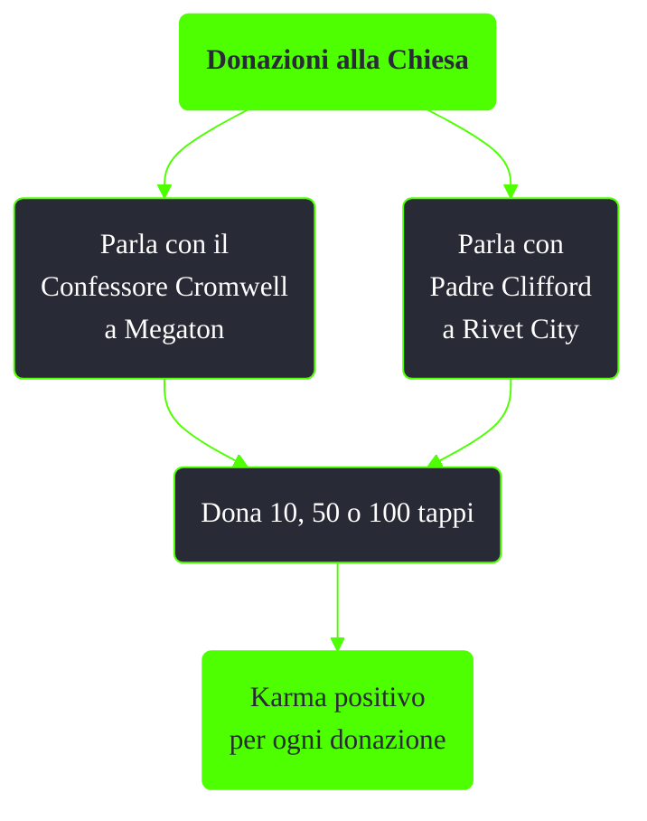

---
# Title, summary, and page position.
linktitle: Donazioni alla Chiesa
summary: ""
weight: 10
icon: message-question
icon_pack: fas

# Page metadata.
title: Donazioni alla Chiesa
date: 2022-11-15
type: book # Do not modify.
commentable: true
tags: "Missioni nascoste di Fallout 3"
hidden: true # Visibile nella sidebar
private: false # Nascosto dalle ricerche
---

*TODO* è una missione nascosta e ripetibile di Fallout 3. È data dal Confessore Cromwell a Megaton e Padre Clifford a Rivet City.

Note:
- Il karma positivo guadagnato è proporzionale all'ammontare di tappi donati (10 tappi, 10 punti karma; 50 tappi, 50 punti karma; 100 tappi, 100 punti karma)