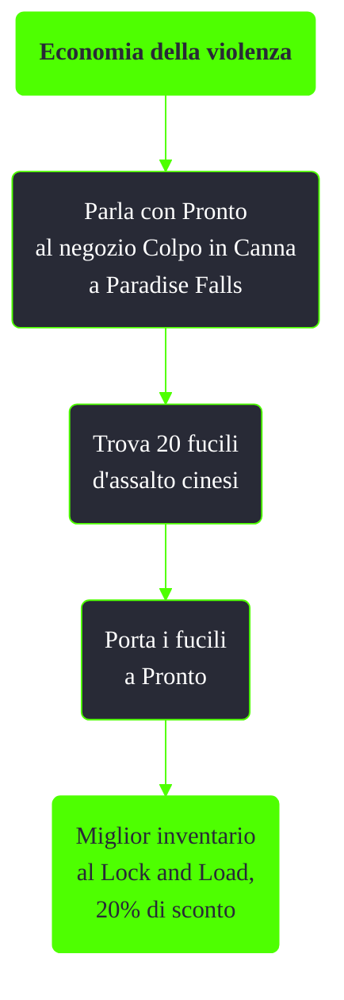

---
# Title, summary, and page position.
linktitle: Economia della violenza
summary: ""
weight: 10
icon: message-question
icon_pack: fas

# Page metadata.
title: Economia della violenza
date: 2022-11-15
type: book # Do not modify.
commentable: true
tags: "Missioni nascoste di Fallout 3"
hidden: true # Visibile nella sidebar
private: false # Nascosto dalle ricerche
---

*Economia della violenza* è una missione nascosta di Fallout 3. È data da Pronto a Paradise Falls.

Note:
- Dove trovare i fucili d'assalto cinesi:
  - soldati cinesi a Mama Dolce
  - sui supermutanti capo
  - sui mercenari della Compagnia dell'Artiglio
  - nell'armeria di Megaton e di Rivet City
  - al Flak 'N Shrapnel di Rivet City
  - nell'edificio del Campidoglio
  - Nel Pitt, su uno scaffale al secondo piano degli appartamenti abbandonati
  - A Point Lookout, nel bunker vicino la Villa di Calvert
  - Nel Museo di Dave, nella Repubblica di Dave
  - Nel Tunnel di Taft
- Se la missione è già iniziata, uccidere un qualsiasi schiavista a Paradise Falls la farà fallire
- Dopo avergli dato i fucili, bisogna aspettare almeno 24 prima che l'inventario venga aggiornato