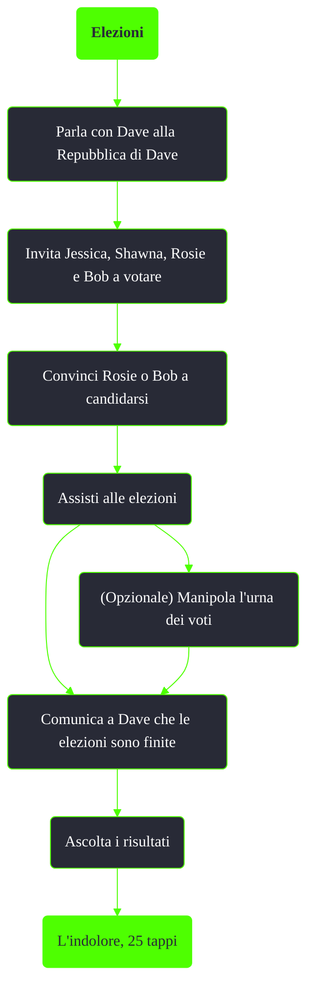

---
# Title, summary, and page position.
linktitle: Elezioni
summary: ""
weight: 10
icon: message-question
icon_pack: fas

# Page metadata.
title: Elezioni
date: 2022-11-15
type: book # Do not modify.
commentable: true
tags: "Missioni nascoste di Fallout 3"
hidden: true # Visibile nella sidebar
private: false # Nascosto dalle ricerche
---

*Elezioni* è una missione nascosta di Fallout 3. È data da Dave alla Repubblica di Dave.

Note:
- Facendo vincere Rosie o Bob, Dave lascerà la Repubblica e si incamminerà verso il Vecchio Olney, le cui rovine sono infestate dai deathclaw
    - Allontanandosi dalla Repubblica, sarà possibile uccidere Dave per impossessarsi del suo fucile unico **L'indolore** (all'interno della cassaforte del Campidoglio) e la chiave necessaria per la missione *Devi mirare alla testa*