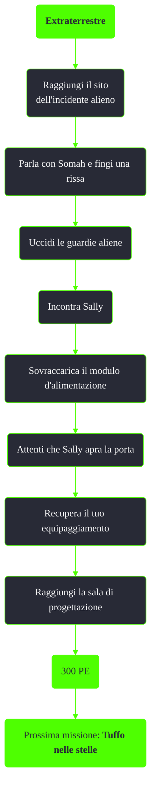

---
# Title, summary, and page position.
linktitle: Extraterrestre
summary: ""
weight: 10
icon: message-question
icon_pack: fas

# Page metadata.
title: Extraterrestre
date: 2022-11-15
type: book # Do not modify.
commentable: true
tags: "Missioni di Mothership Zeta"
hidden: true # Visibile nella sidebar
private: false # Nascosto dalle ricerche
---

*Extraterrestre* è una missione del DLC *Mothership Zeta* di Fallout 3. È data dal segnale autoguidato alieno.

| Tappe |       Stato        | Descrizione                                                                    |
|:-----:|:------------------:| ------------------------------------------------------------------------------ |
|  10   |                    | Indaga sullo strano segnale radio pervenuto dalla Zona contaminata.            |
|  20   |                    | Trova una via d'uscita dalla cella.                                            |
|  25   |                    | Inscena un combattimento contro Somah per attirare l'attenzione delle guardie. |
|  27   |                    | Sconfiggi le guardie aliene.                                                   |
|  30   |                    | Recupera il tuo equipaggiamento.                                               |
|  35   |                    | Continua a cercare una via d'uscita dalla cella.                               |
|  40   |                    | Libera Sally dalla sua cella.                                                  |
|  50   | :white_check_mark: | Raggiungi la sala di progettazione della nave.                                 |
|  60   |                    | (Opzionale) Libera altri prigionieri dalle loro celle.                         |

Note:
- Uccidere gli operai alieni farà guadagnare karma negativo
