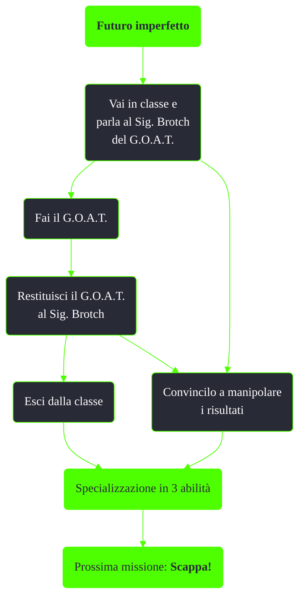

---
# Title, summary, and page position.
linktitle: Futuro imperfetto
summary: ""
weight: 10
icon: messages # message-question per le missioni nascoste
icon_pack: fas

# Page metadata.
title: Futuro imperfetto
date: 2022-11-15
type: book # Do not modify.
commentable: true
tags: "Missioni tutorial di Fallout 3"
hidden: true # Visibile nella sidebar
private: false # Nascosto dalle ricerche
---

*Futuro imperfetto* è la terza missione principale di Fallout 3. È data da James al Vault 101

<section class="chart-collapse">
<input type="checkbox" name="collapse2" id="handle2">
<h3 class="handle">
<label for="handle2">Clicca per mostrare il diagramma</label>
</h3>

</section>

| Tappe | Stato              | Descrizione                                       |
| :---: | :----------------: | ------------------------------------------------- |
|  10   |                    | Vai in classe e parla al Sig. Brotch del G.O.A.T. |
|  40   |                    | Siediti e prendi il G.O.A.T.                      |
|  70   |                    | Restituisci il G.O.A.T. al Sig. Brotch.           |
|  80   | :white_check_mark: | Esci dalla classe.                                |

**Note**:
- È possibile bypassare il G.O.A.T. semplicemente parlando al Sig. Brotch prima di entrare in classe
- È possibile cambiare le specialità dopo aver fatto il G.O.A.T. e poco prima di abbandonare il Vault, durante la missione *Scappa!*

