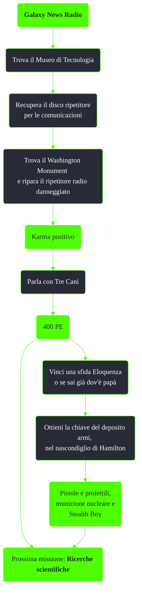

---
# Title, summary, and page position.
linktitle: Galaxy News Radio
summary: ""
weight: 10
icon: messages # message-question per le missioni nascoste
icon_pack: fas

# Page metadata.
title: Galaxy News Radio
date: 2022-11-15
type: book # Do not modify.
commentable: true
tags: "Missioni principali di Fallout 3"
hidden: true # Visibile nella sidebar
private: false # Nascosto dalle ricerche
---

*Galaxy News Radio* è una missione principale di Fallout 3. È data da Tre Cani all'edificio di GNR.

| Tappe |       Stato        | Descrizione                                        |
| :---: | :----------------: | -------------------------------------------------- |
|  10   |                    | Trova il Museo della Tecnologia.                   |
|  20   |                    | Recupera il disco ripetitore per le comunicazioni. |
|  30   |                    | Trova il Washington Monument.                      |
|  40   |                    | Ripara il ripetitore radio danneggiato.            |
|  50   | :white_check_mark: | Parla di papà con Tre Cani.                        |
|  55   |                    | Parla a Tre Cani del deposito di armi              |

Note:
- Sebbene sia una missione principale, è possibile saltarla prendendo direttamente i diari personari del Progetto Purezza al Jefferson Memorial, parlando con la Dottoressa Li a Rivet City o dirigendosi direttamente al Vault 112
- Finita la missione la portata di Galaxy New Radio coprirà l'intera regione della Zona contaminata della Capitale