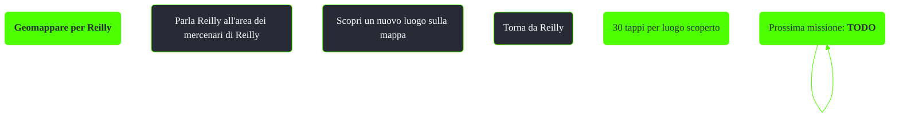

---
# Title, summary, and page position.
linktitle: Geomappare per Reilly
summary: ""
weight: 10
icon: message-question
icon_pack: fas

# Page metadata.
title: Geomappare per Reilly
date: 2022-11-15
type: book # Do not modify.
commentable: true
tags: "Missioni nascoste di Fallout 3"
hidden: true # Visibile nella sidebar
private: false # Nascosto dalle ricerche
---

*Geomappare per Reilly* è una missione nascosta e ripetibile di Fallout 3. È data da Relly all'area dei mercenari di Reilly.

<section class="chart-collapse">
<input type="checkbox" name="collapse2" id="handle2">
<h3 class="handle">
<label for="handle2">Clicca per mostrare il diagramma</label>
</h3>

</section>

**Note**:
- La missione viene fornita subito dopo aver completato *Mercenari di Reilly*, salvando i mercenari dalle ondate di supermutanti 
- Non vengono conteggiati i luoghi aggiunti dai DLC
- Il conteggio è retroattivo, quindi saranno validi i luoghi già scoperti prima di iniziare la missione
- Essendoci 163 luoghi sulla mappa il guadagno totale possibile è di 4890 tappi
  - Sono necessarie le abilità extra Omicida su contratto e Portatore di legge per ottenere tutti i luoghi per il geomapper 

