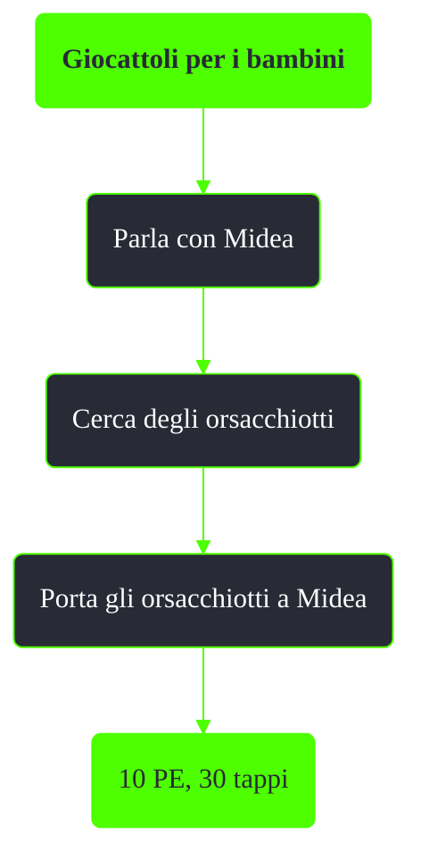

---
# Title, summary, and page position.
linktitle: Giocattoli per i bambini
summary: ""
weight: 10
icon: message-question
icon_pack: fas

# Page metadata.
title: Giocattoli per i bambini
date: 2022-11-15
type: book # Do not modify.
commentable: true
tags: "Missioni del Pitt"
hidden: true # Visibile nella sidebar
private: false # Nascosto dalle ricerche
---

*Giocattoli per i bambini* è una missione nascosta del DLC *The Pitt* di Fallout 3. È data da Midea alla periferia del Pitt, dopo aver completato *Lavoro libero*.

Note:
- Questa missione è disponibile solo se si rapisce il bambino in *Lavoro libero*
