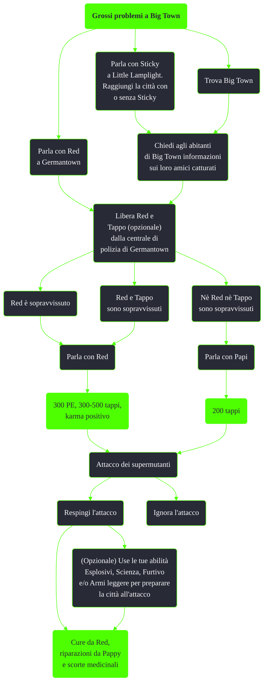

---
# Title, summary, and page position.
linktitle: Grossi problemi a Big Town
summary: ""
weight: 10
icon: messages # message-question per le missioni nascoste
icon_pack: fas

# Page metadata.
title: Grossi problemi a Big Town
date: 2022-11-15
type: book # Do not modify.
commentable: true
tags: "Missioni secondarie di Fallout 3"
hidden: true # Visibile nella sidebar
private: false # Nascosto dalle ricerche
---

*Grossi problemi a Big Town* è una missione secondaria di Fallout 3. È data da Dusty a Big Town.

| Tappe |       Stato        | Descrizione                                                            |
| :---: | :----------------: | ---------------------------------------------------------------------- |
|  10   |                    | Chiedi alle persone di Big Town informazioni sui loro amici catturati. |
|  20   |                    | Salva i prigionieri di Big Town dai Supermutanti.                      |
|  25   |                    | Salva Red.                                                             |
|  30   |                    | Riaccompagna Red al sicuro a Big Town.                                 |
|  40   |                    | (Facoltativo) Salva Tappo.                                             |
|  45   |                    | Riaccompagna Tappo al sicuro a Big Town.                               |
|  49   | :white_check_mark: | Spiega la morte di Red alle persone di Big Town.                       |
|  50   | :white_check_mark: | Parla con Red della tua ricompensa.                                    |

Note:
- Con *Broken Steel* installato è possibile che un supermutante overlord compaia proprio fuori dall'uscita
- Non è possibile completare questa missione se Red è già stato schiavizzato per la missione *Solo affari*. È necessario rimuovere il collare o ucciderlo
- Avere Fawkes come Seguace consente al giocatore di suggerire di usare dell'esplosivo per difendere la città. Ciò comporterà la comparsa di alcune mine a frammentazione intorno a Fawkes ogni 5-10 secondi TODO