---
# Title, summary, and page position.
linktitle: Guida di sopravvivenza della Zona contaminata
summary: ""
weight: 10
icon: messages # message-question per le missioni nascoste
icon_pack: fas

# Page metadata.
title: Guida di sopravvivenza della Zona contaminata
date: 2022-11-15
type: book # Do not modify.
commentable: true
tags: "Missioni secondarie di Fallout 3"
hidden: true # Visibile nella sidebar
private: false # Nascosto dalle ricerche
---

*Guida di sopravvivenza della Zona contaminata* è una missione secondaria di Fallout 3. È data da Moira Brown a Megaton.

<section class="chart-collapse">
<input type="checkbox" name="collapse2" id="handle2">
<h3 class="handle">
<label for="handle2">Clicca per mostrare il diagramma</label>
</h3>

</section>

```mermaid
%%{init: {'theme': 'base', 'themeVariables': { 'primaryColor': '#282a36', 'primaryBorderColor': '#4eff01', 'primaryTextColor': '#fff', 'lineColor': '#4eff01', 'fontFamily': 'Jura'}}}%%
graph TD;
    id1(<b>Guida di sopravvivenza <br />della Zona contaminata</b>):::questfo3
    id2(Parla con Moira Brown <br />a Megaton sulla scrittura <br />del suo libro)
    id3(Completa tutte e tre <br />le parti del primo capitolo)
    id4(Prendi il cibo al <br />Super-Duper Mart)
    id5(Contrai almeno <br />200 RAD)
    id6(Viaggia fino al <br />campo di giochi <br />di Minefield)
    id7(Prendi anche <br />le medicine) 
    id8(Contrai almeno <br />600 RAD)
    id9(Prendi una mina <br />a frammentazione)
    id10(Sterilizzante <br />per alimenti):::rewardfo3 
    id11(Abilità extra: <br />Rigenerazione da <br />radiazioni):::rewardfo3 
    id12(Schemi - Mina da tappo):::rewardfo3 
    id13(Bocconcini di iguana):::rewardfo3 
    id14(RadAway e Rad-X):::rewardfo3 
    id15(Mine a frammentazione):::rewardfo3
    id16(100 PE, stimpak):::rewardfo3
    id17(Completa tutte e <br />tre le parti del <br />secondo capitolo)
    id18(Usa il bastone <br />repellente su <br />almeno tre rattitalpa)
    id19(Colloca l'osservatore <br />in un baccello <br />di riproduzione <br />nell'Anchorage <br />Memorial)
    id20(Porta la tua salute <br />a meno del 50%)
    id21(Usalo su altri <br />sette rattitalpa)
    id22(Non uccidere <br />alcun mirelurk)
    id23(Procurati una <br />menomazione)
    id24(Bastone repellente):::rewardfo3
    id25(Cappello sospetto):::rewardfo3
    id26(Tuta protettiva):::rewardfo3
    id27(Jet e Psycho):::rewardfo3
    id28(Stealth Boy):::rewardfo3
    id29(Med-X):::rewardfo3
    id30(100 PE, munizioni):::rewardfo3
    id31(Completa tutte e <br />tre le parti del <br />terzo capitolo)
    id32(Apprendi la storia <br />di Rivet City da Bannon)
    id33(Installa il processore <br />nel computer centrale <br />dell'impianto RobCo)
    id34(Accedi al catalogo <br />schede nella Biblioteca <br />di Arlington)
    id35(Apprendi la vera <br />storia da Pinkerton)
    id36(Riprogramma il <br />computer centrale)
    id37(Recupera gli <br />archivi completi)
    id38(Sconto a Rivet City):::rewardfo3
    id39(Il grande libro <br />della scienza):::rewardfo3
    id40(Stile da congresso, <br />menzognero):::rewardfo3
    id41(Mentats):::rewardfo3
    id42(Granate a impulsi):::rewardfo3
    id43(Tappi):::rewardfo3
    id44("100 PE, <br />munizione nucleare, <br />copia della Guida <br />di sopravvivenza <br />della Zona contaminata, <br />abilità extra: <br />Superstite principiante/<br />Esperto in sopravvivenza/<br />Guru di sopravvivenza"):::rewardfo3
    id45(Convincila a <br />lasciar perdere)
    id46("PE, sconto allo Spaccio <br />di Craterside, <br />abilità extra: <br />Infrangisogni"):::rewardfo3
    id1-->id2-->id3-->id4 & id5 & id6
    id4-->id7-->id10-->id13-->id16
    id5-->id8-->id11-->id14-->id16
    id6-->id9-->id12-->id15-->id16
    id4-->id13
    id5-->id14
    id6-->id15
    id16-->id17-->id18 & id19 & id20
    id18-->id21-->id24-->id27-->id30
    id19-->id22-->id25-->id28-->id30
    id20-->id23-->id26-->id29-->id30
    id18-->id27
    id19-->id28
    id20-->id29
    id30-->id31-->id32 & id33 & id34
    id32-->id35-->id38-->id41-->id44
    id33-->id36-->id39-->id42-->id44
    id34-->id37-->id40-->id43-->id44
    id32-->id41
    id33-->id42
    id34-->id43
    id2-->id45-->id46
    
    
    
    
    
    
    
    classDef rewardfo3 fill:#4eff01, stroke:#4eff01, color:#282a36;
    classDef questfo3 fill:#4eff01, stroke:#4eff01, color:#282a36;
```

### Opzioni di dialogo uniche (Capitolo I)
Una volta completati gli obiettivi della missione, selezionando una maggioranza di risposte della rispettiva tipologia (standard, sarcastico, intelligente, duro o scaltro) è possibile ottenere un differente bonus dall'abilità extra Esperto di sopravvivenza (e le sue varianti Superstite principiante e Guru di sopravvivenza). 

*Vedi le note in basso e la voce riguardante l'abilità extra Esperto di sopravvivenza (TODO) per maggiori dettagli*

#### Super-Duper Mart

| Tipo         | Risposta (senza obiettivo facoltativo)                                       | Requisito | Bonus |
| ------------ | ---------------------------------------------------------------------------- | --------- | ----- |
| Standard     | C'è un sacco di cibo in più che negli altri posti, ma avevo compagnia.       | No        | No    |
| Sarcastico   | Quel luogo era una trappola mortale. Brulicava di predatori.                 | No        | No    |
| Intelligente | Ho incontrato alcuni predatori, ma è stato facile fregarli.                  | INT 7     | No    |
| Duro         | Ho il cibo e ho trattato con quelle femminucce di?Predatori. Li ho dominati. | FRZ 7     | No    |
| Scaltro      | Quei grandi negozi bui sono ideali per nascondersi.                          | AGI 7     | No    |

| Tipo         | Risposta (con obiettivo facoltativo)                                             | Requisito | Bonus |
| ------------ | -------------------------------------------------------------------------------- | --------- | ----- |
| Standard     | Ho trovato predatori e un robot. Non era certo un posto sicuro per cercare cibo. | No        | Sì    |
| Sarcastico   | Ero ad una festa con dei predatori. Poi un robot guardia è sbucato dalla torta.  | No        | Sì    |
| Intelligente | I predatori conservavano la loro migliore attrezzatura nella farmacia.           | INT 7     | Sì    |
| Duro         | Quei Predatori mi hanno sparato una ventina di colpi. Ma chi sta contando?       | STA 7     | Sì    |
| Scaltro      | È difficile comunicare con gente che ti spara contro...                          | CAR 7     | Sì    |

### Malattia da radiazioni

| Tipo         | Risposta (senza obiettivo facoltativo)                                              | Requisito | Bonus |
| ------------ | ----------------------------------------------------------------------------------- | --------- | ----- |
| Standard     | Prurito e piaghe. Non il peggio che mi sia capitato, ma nemmeno uno spasso.         | No        | No    |
| Sarcastico   | Perché non ti bevi un bel bicchierone di acqua di scolo e lo scopri da te?          | No        | No    |
| Intelligente | Le emicranie sicuramente rendono difficile concentrarsi.                            | INT 7     | No    |
| Intelligente | Non temere! Con la mia vasta conoscenza scientifica, lo so spiegare senza problemi. | Scienza   | Sì    |
| Duro         | Posso a malapena sentirle. La malattia da radiazioni è per i deboli.                | STA 7     | No    |
| Scaltro      | Mi piace considerare la cosa un arricchimento della mia brillante personalità.      | CAR 7     | No    |

| Tipo         | Risposta (con obiettivo facoltativo)                                      | Requisito   | Bonus |
| ------------ | ------------------------------------------------------------------------- | ----------- | ----- |
| Standard     | Fai il tuo esame e rimettimi in sesto, per favore.                        | No          | Sì    |
| Sarcastico   | Mi sento per come ti vedo.                                                | Moira ghoul | Sì    |
| Sarcastico   | TODO Troppa... stanchezza... per agire... furtivamente.                   | No          | Sì    |
| Intelligente | Se ascolto attentamente, riesco a sentire i miei geni che piangono.       | PER 7       | Sì    |
| Duro         | Prude un po', ma ci posso passare sopra.                                  | STA 7       | Sì    |
| Scaltro      | Oh, sto bene! <tosse> Mai stato meglio! <tosse> Nessun problema! <ansima> | CAR 7       | Sì    |

### Minefield

| Tipo         | Risposta (senza obiettivo facoltativo)                                           | Requisito | Bonus |
| ------------ | -------------------------------------------------------------------------------- | --------- | ----- |
| Standard     | No, ma ci è mancato poco. Muoversi lentamente ed evitare il fango è stato utile. | No        | No    |
| Sarcastico   | Sì, mi ha ucciso un'esplosione. Ora ti perseguito per quel libro idiota. Buu.    | No        | No    |
| Intelligente | Tecnicamente sono le mine che esplodono, non io. E comunque no.                  | INT 7     | No    |
| Duro         | TODO  Non ne potevo più. Mi sento meglio. Devi essere forte.                     | STA 7     | No    |
| Scaltro      | Ho la grazia di un gatto. Nessuna mina potrà fermarmi.                           | AGI 7     | No    |

| Tipo         | Risposta (con obiettivo facoltativo)                                            | Requisito | Bonus |
| ------------ | ------------------------------------------------------------------------------- | --------- | ----- |
| Standard     | Quel posto è una trappola mortale.                                              | No        | Sì    |
| Standard     | Tutta la città è una trappola. C'era un cecchino che aspettava solo me.         | No        | Sì    |
| Sarcastico   | Oh, disinnescarla è davvero facile. Basta saltarci sopra. Vai prima tu.         | No        | Sì    |
| Intelligente | Osserva i dettagli e cerca i percorsi interrotti. Le trappole sono lì.          | PER 7     | Sì    |
| Duro         | Ci sono state una o due esplosioni. Ah, e un cecchino. Niente di serio.         | STA 7     | Sì    |
| Scaltro      | Mani veloci e menti rapidissime possono darti molto. Incluso le mine terrestri. | AGI 7     | Sì    |

### Opzioni di dialogo uniche (Capitolo II)

### Rattitalpa

| Tipo         | Risposta (senza obiettivo facoltativo)                                           | Requisito | Bonus |
| ------------ | -------------------------------------------------------------------------------- | --------- | ----- |
| Standard     | Non penso che funzionerà come speri. I ratti talpa sono tutti morti.             | No        | No    |
| Sarcastico   | Smembrava gli arti dai corpi. Puoi farne uno che funzioni per le persone?        | No        | No    |
| Intelligente | Devi aver usato troppo stimolante chimico. Il risultato era piuttosto esplosivo. | INT 7     | No    |
| Duro         | I ratti talpa sono appena saltati in aria! Avresti dovuto vedere che macello!    | FRZ 7     | No    |
| Scaltro      | Beh, almeno non è letale per gli umani. Per i ratti talpa... non molto.          | CAR 7     | No    |

| Tipo         | Risposta (con obiettivo facoltativo)                                            | Requisito | Bonus |
| ------------ | ------------------------------------------------------------------------------- | --------- | ----- |
| Standard     | Mi dispiace, Moira, ma il tuo "repellente" è fatale per i ratti talpa.          | No        | Sì    |
| Sarcastico   | È come il ratto talpa esplosivo. Posso averlo in forma di proiettili?           | No        | Sì    |
| Intelligente | Sembra che causi un'allergia fatale ai ratti talpa, in pratica li fa esplodere. | INT 7     | Sì    |
| Duro         | Gli ha dato un gran bel calcio, forse troppo jet o qualcosa di simile.          | STA 7     | Sì    |
| Scaltro      | Non credo che questo sia non-letale quanto mi aspettavo. Per dirla semplice.    | CAR 7     | Sì    |

### Mirelurk

| Tipo         | Risposta (senza obiettivo facoltativo)                                       | Requisito | Bonus |
| ------------ | ---------------------------------------------------------------------------- | --------- | ----- |
| Standard     | In sostanza sono umanoidi a forma di granchio.                               | No        | No    |
| Sarcastico   | Cosa c'è da dire? Sono granchi. Sono ottimi e nutrienti.                     | No        | No    |
| Intelligente | Le loro tane sono parzialmente acquatiche, le radiazioni non li danneggiano. | PER 7     | No    |
| Duro         | Fra gusci e scaglie sono piuttosto duri. Ma non abbastanza.                  | FRZ 7     | No    |
| Scaltro      | Sono selvaggi con grandi chele e poco amore per la conversazione.            | CAR 7     | No    |

| Tipo         | Risposta (con obiettivo facoltativo)                                              | Requisito | Bonus |
| ------------ | --------------------------------------------------------------------------------- | --------- | ----- |
| Standard     | Sono cattivi e molto territoriali.                                                | No        | Sì    |
| Sarcastico   | C'è questo piccolo castello di bolle e ci girano intorno tutto il giorno. <Bugia> | No        | Sì    |
| Intelligente | Discendono dai granchi del luogo. Puoi chiamarli "Scylla Serrata Horrendus".      | INT 7     | Sì    |
| Duro         | Non sembra che combattano tra loro. Nessuna lotta per il potere.                  | FRZ 7     | Sì    |
| Scaltro      | Sembrano indipendenti. Non credo che abbiano qualche tipo di "società".           | CAR 7     | Sì    |

### Ferite

| Tipo         | Risposta (senza obiettivo facoltativo)                                          | Requisito | Bonus |
| ------------ | ------------------------------------------------------------------------------- | --------- | ----- |
| Intelligente | Si tratta di traumi fisici gravi e lacerazioni profonde. Non è molto piacevole. | INT 7     | No    |
| Duro         | Questi graffietti? Non sono certo le peggiori ferite della mia vita.            | STA 7     | No    |
| Sarcastico   | Su una scala da uno a dieci, direi che è un "chiudi il becco e curami".         | No        | No    |
| Standard     | Mi sento come se tanti Supermutanti avessero ballato su di me con i tacchi.     | No        | No    |
| Scaltro      | Scusa se perdo molto sangue mentre penso a come descrivere questo dolore.       | CAR 7     | No    |

| Tipo         | Risposta (con obiettivo facoltativo)                                             | Requisito | Bonus |
| ------------ | -------------------------------------------------------------------------------- | --------- | ----- |
| Standard     | L'adrenalina aiuta, così come la paura della morte. Non manca nessuna delle due. | No        | Sì    |
| Intelligente | Il dolore è astratto. Io mi concentro sulle cose importanti, come sopravvivere.  | INT 7     | Sì    |
| Sarcastico   | Mi solleva solo il pensiero di infliggere dolori come questo a gente come te.    | No        | Sì    |
| Duro         | Non sento quasi più il dolore, onestamente.                                      | STA 7     | Sì    |
| Scaltro      | Con tutte le imprecazioni che conosco non ne trovo una adatta per questo dolore. | CAR 7     | Sì    |

### Opzioni di dialogo uniche (Capitolo III)

#### Rivet City

| Tipo         | Risposta (senza obiettivo facoltativo)                                        | Requisito | Bonus |
| ------------ | ----------------------------------------------------------------------------- | --------- | ----- |
| Standard     | Secondo loro, è stato preparato tutto da un residente del Ponte di coperta.   | No        | No    |
| Sarcastico   | Suppongo di aver sentito una storia abbastanza plausibile. Andiamo avanti...  | No        | No    |
| Intelligente | Ci sono troppi racconti e non abbastanza prove per confermarne uno.           | PER 7     | No    |
| Duro         | Quei duri del Ponte di coperta hanno costruito questo posto da zero!          | FRZ 7     | No    |
| Scaltro      | Tutti raccontano una storia diversa: diciamo che l'ho creato io questo posto. | CAR 7     | No    |

| Tipo         | Risposta (con obiettivo facoltativo)                                             | Requisito | Bonus |
| ------------ | -------------------------------------------------------------------------------- | --------- | ----- |
| Standard     | Era una base scientifica e i commercianti si sono stabiliti nei dintorni.        | No        | Sì    |
| Sarcastico   | Qualche vecchio stupido dice di aver preso queste note. Mi sembrano ragionevoli. | No        | Sì    |
| Intelligente | Era una stazione di ricerca, ecco perché è ancora una base scientifica.          | INT 7     | Sì    |
| Duro         | Hanno eliminato i Mirelurks, poi gli scienziati e il resto e si sono trasferiti. | FRZ 7     | Sì    |
| Scaltro      | Era una base scientifica di successo e la gente segue il successo.               | CAR 7     | Sì    |

#### Impianto RobCo

| Tipo         | Risposta (senza obiettivo facoltativo)                                           | Requisito | Bonus |
| ------------ | -------------------------------------------------------------------------------- | --------- | ----- |
| Standard     | Collegare l'unità è stato semplice. Il computer centrale ha fatto il resto.      | No        | No    |
| Sarcastico   | Non ho neppure bisogno di un'unità tele-cosa. Ero già a posto così. <Bugia.>     | No        | No    |
| Intelligente | L'installazione è stata molto più semplice che raggiungere il computer centrale. | INT 7     | No    |
| Duro         | L'unità è entrata nel computer, quindi i robot si sono svegliati. Semplice.      | FRZ 7     | No    |
| Scaltro      | Se ci sai fare, i robot ti obbediranno, proprio come le persone.                 | CAR 7     | No    |

| Tipo         | Risposta (con obiettivo facoltativo)                                             | Requisito           | Bonus |
| ------------ | -------------------------------------------------------------------------------- | ------------------- | ----- |
| Standard     | Una volta sistemata la programmazione, i robot non erano più un problema.        | No                  | Sì    |
| Sarcastico   | È stata una strage di robot. Ma l'ho causata io, quindi è stata giusta.          | No                  | Sì    |
| Intelligente | Potrei scrivere quella sezione per te. Credimi: so il fatto mio.                 | Esperto in robotica | Sì    |
| Intelligente | Anche dopo la riprogrammazione, i robot furono alleati di valore discutibile.    | INT 7               | Sì    |
| Duro         | Ho appena violato il computer centrale, dunque i robot non saranno un problema.  | FRZ 7               | Sì    |
| Scaltro      | Come un incantesimo. Vorrei che fosse sempre così semplice manipolare gli altri. | CAR 7               | Sì    |

#### Biblioteca di Arlington

| Tipo         | Risposta (senza obiettivo facoltativo)                                              | Requisito | Bonus |
| ------------ | ----------------------------------------------------------------------------------- | --------- | ----- |
| Standard     | Sì, è ancora lì. La Confraternita sta anche cercando di fare pulizia.               | No        | No    |
| Sarcastico   | Avrei potuto recuperarne di più, ma ho dovuto fermarmi e chiudere. Chi se ne frega. | No        | No    |
| Intelligente | L'edificio è ancora lì, ma i libri sono tutti rovinati.                             | PER 7     | No    |
| Duro         | La maggior parte dei libri sarebbe meglio bruciarli che leggerli.                   | STA 7     | No    |
| Scaltro      | Oh, è ancora lì, ma è piena di predatori. Quel posto è una trappola mortale.        | CAR 7     | No    |

| Tipo         | Risposta (con obiettivo facoltativo)                                             | Requisito | Bonus |
| ------------ | -------------------------------------------------------------------------------- | --------- | ----- |
| Standard     | L'archivio era probabilmente la cosa più utile lì dentro.                        | No        | Sì    |
| Sarcastico   | Il bibliotecario è in servizio. Ti avrei portato un regalo ma non ho la tessera. | No        | Sì    |
| Intelligente | Questo è l'intero archivio di una biblioteca. Sai quanto può valere, vero?       | INT 7     | Sì    |
| Duro         | Ora puoi proteggere e catalogare tutte le informazioni che c'erano una volta.    | STA 7     | Sì    |
| Scaltro      | Il posto era una trappola mortale ma sono velocemente stato dentro e poi fuori.  | AGI 7     | Sì    |

| Tappe |       Stato        | Descrizione                                                                            |
| :---: | :----------------: | -------------------------------------------------------------------------------------- |
|   2   |                    | Chiedi a Moira Brown del suo libro.                                                    |
|   5   |                    | Aiuta Moira con il capitolo 1.                                                         |
|  10   |                    | Trova cibo nel Super-Duper Mart.                                                       |
|  12   |                    | (Facoltativo) Trova medicinali nel Super-Duper Mart.                                   |
|  16   |                    | Torna da Moira.                                                                        |
|  20   |                    | Contrai malattia da radiazioni (200 RAD).                                              |
|  24   |                    | (Facoltativo) Contrai più malattie gravi da radiazioni (600 RAD).                      |
|  26   |                    | Torna da Moira.                                                                        |
|  30   |                    | Viaggia fino al campo giochi di Minefield.                                             |
|  34   |                    | (Facoltativo) Porta una mina a Moira.                                                  |
|  36   |                    | Torna da Moira.                                                                        |
|  38   |                    | Aiuta Moira con il capitolo 2.                                                         |
|  40   |                    | Prova il repellente su tre Ratti talpa.                                                |
|  44   |                    | (Facoltativo) Prova il repellente su altri sette Ratti talpa.                          |
|  46   |                    | Torna da Moira.                                                                        |
|  50   |                    | Colloca l'osservatore in un baccello di riproduzione nel Monumento Anchorage Memorial. |
|  54   |                    | (Facoltativo) Non uccidere alcun Mirelurk nel Monumento Anchorage Memorial.            |
|  56   |                    | Torna da Moira.                                                                        |
|  60   |                    | Ferisciti gravemente (salute al 50% o meno).                                           |
|  64   |                    | (Facoltativo) Subisci una menomazione.                                                 |
|  66   |                    | Torna da Moira con le tue ferite.                                                      |
|  68   |                    | Aiuta Moira con l'ultimo capitolo.                                                     |
|  70   |                    | Apprendi la storia di Rivet City.                                                      |
|  74   |                    | (Facoltativo) Controlla altre fonti per confermare la storia di Rivet City.            |
|  76   |                    | (Facoltativo) Scopri la vera storia di Rivet City.                                     |
|  78   |                    | Torna da Moira.                                                                        |
|  80   |                    | Installa il processore nel computer centrale dell'impianto di produzione RobCo.        |
|  84   |                    | (Facoltativo) Riprogramma il computer centrale dell'impianto di produzione RobCo.      |
|  88   |                    | Torna da Moira.                                                                        |
|  90   |                    | Accedi al catalogo schede nella Biblioteca pubblica di Arlington.                      |
|  94   |                    | (Facoltativo) Recupera gli archivi bibliotecari completi.                              |
|  98   | :white_check_mark: | Torna da Moira.                                                                        |

**Note**:
- Ogni parte del capitolo può essere fatta in qualsiasi ordine e solo completando gli obiettivi facoltativi si avranno dei bonus finali importanti
- Sebbene si possa considerare ogni capitolo una missione a se stante, questi condividono i meccanismi delle ricompense:
  - Tutte le ricompense che riguardano oggetti non unici (es. stimpak, droghe, cibo...) vengono assegnate in quantità proporzionata al livello del giocatore
  - Al giocatore vengono fornite delle opzioni di dialogo in base a tutte le sue statistiche SPECIAL che hanno un valore minimo di 7 (es. per avere le opzioni di dialogo Stamina, bisogna vere la Stamina ≥ 7)
    - Se si hanno più statistiche al livello 7 o superiori, saranno disponibili più opzioni di dialogo
    - È possibile aumentare temporaneamente gli SPECIAL (con vestiti o droghe) per sbloccare le opzioni di dialogo aggiuntive
  - Le opzioni di dialogo scelte dal giocatore influenzano sia lo stile del libro sia il grado dell'abilità extra Esperto in sopravvivenza ottenuta: un libro completo (con tutti gli obiettivi facoltativi completati) farà ottenere il massimo del bonus (Guru di sopravvivenza), mentre un libro standard (con solo alcuni o nessun obiettivo facoltativo completato) farà guadagnare un bonus parziale o bonus molto basso (Esperto di sopravvivenza o Superstite sopravvissuto)
  - La caratterizzazione del bonus fornito da questa abilità si ricava sulla maggioranza di dialoghi scelti della stessa tipologia:
    - Maggioranza di risposte standard: aumento HP
    - Maggioranza di risposte sarcastiche: aumento occasioni colpi letali
    - Maggioranza di risposte intelligenti (Intelligenza o Percezione ≥ 7): aumento abilità Scienza e Medicina
    - Maggioranza di risposte dure (Forza o Stamina ≥ 7): aumento resistenza danni, fuoco e radiazioni
    - Maggioranza di risposte scaltre (Carisma o Agilità ≥): aumento abilità Furtivo e Eloquenza
    - Maggioranza di bugie: nessun bonus
- Se si fa saltare in aria Megaton è ancora possibile ottenere/completare questa missione: se la missione non è stata ancora fornita è possibile trovare Moira fra le macerie della città, mentre se è già stata fornita Moira avrà trovato rifugio agli Inferi
- Completare *L'uomo duplicato* potrebbe interferire con la parte della missione riguardante la storia di Rivet City
- Moira proporrà di usare il bastone repellente contro i rattitalpa delle fogne tiepide ma si può usare sui rattitalpa di tutta la Zona contaminata

