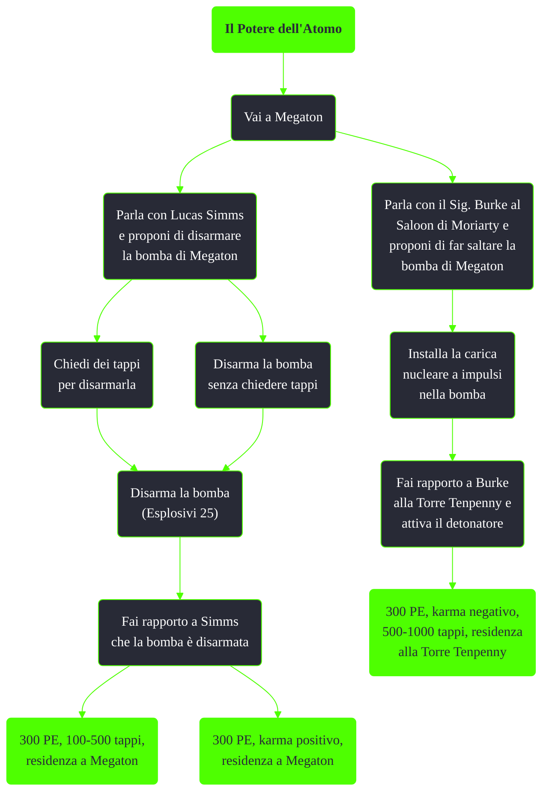

---
# Title, summary, and page position.
linktitle: Il Potere dell'Atomo
summary: ""
weight: 10
icon: messages # message-question per le missioni nascoste
icon_pack: fas

# Page metadata.
title: Il Potere dell'Atomo
date: 2022-11-15
type: book # Do not modify.
commentable: true
tags: "Missioni secondarie di Fallout 3"
hidden: true # Visibile nella sidebar
private: false # Nascosto dalle ricerche
---

*Il Potere dell'Atomo* è una missione secondaria di Fallout 3. È data da Lucas Simms a Megaton e da Mister Burke alla Torre Tenpenny.

<section class="chart-collapse">
<input type="checkbox" name="collapse2" id="handle2">
<h3 class="handle">
<label for="handle2">Clicca per mostrare il diagramma</label>
</h3>

</section>

| Tappe |       Stato        | Descrizione                                                                             |
| :---: | :----------------: | --------------------------------------------------------------------------------------- |
|   1   |                    | [Opzionale] Vai da Leo Stahl alla Lanterna d'ottone e chiedigli i Mentats.              |
|   2   |                    | [Opzionale] Vai da Leo Stahl all'impianto di trattamento acque e chiedigli dei Mentats. |
|   3   |                    | [Opzionale] Vai da Leo Stahl all'impianto di trattamento acque e rubagli dei Mentats.   |
|  10   |                    | Disinnesca la bomba atomica di Megaton.                                                 |
|  15   |                    | Prepara per la detonazione la bomba atomica di Megaton.                                 |
|  20   |                    | Disinnesca la bomba atomica di Megaton...oppure preparala per la detonazione.           |
|  30   | :white_check_mark: | Fai rapporto a Lucas Simms a Megaton.                                                   |
|  31   | :white_check_mark: | Fai rapporto a Harden, figlio di Lucas Simms, a Megaton.                                |
|  40   |                    | Fai rapporto al Signor Burke nella Torre di Tenpenny.                                   |
|  50   |                    | Attiva il detonatore alla Torre di Tenpenny.                                            |
|  60   | :white_check_mark: | Ricevi la rincompensa dal Signor Burke alla Torre di Tenpenny.                          |

**Note**:
- Superando una sfida Eloquenza è possibile ottenre ben 500 tappi da Simms nel caso  si volesse disinnescare la bomba
- È possibile accettare la proposta di Simms, parlare con Burke, denunciarlo a Simms e lasciare che Burke uccida lo sceriffo per ottenere così lo spolverino da sceriffo unico e la chiave della sua residenza (dove è possibile trovare la **Bambolina - Forza**)
- È possibile uccidere in qualunque momento il Sig. Burke senza rendere ostili gli abitanti di Megaton
- Per ottenere sia la ricompensa in tappi che il karma positivo bisogna disinnescare la bomba prima di parlare con Simms
- Scegliendo di far esplodere Megaton, Moira diventerà un ghoul e sarà ancora possibile iniziare/completare la missione *Guida di sopravvivenza della Zona contaminata
  - Non sarà invece possibile recuperare la **Bambolina - Forza**

