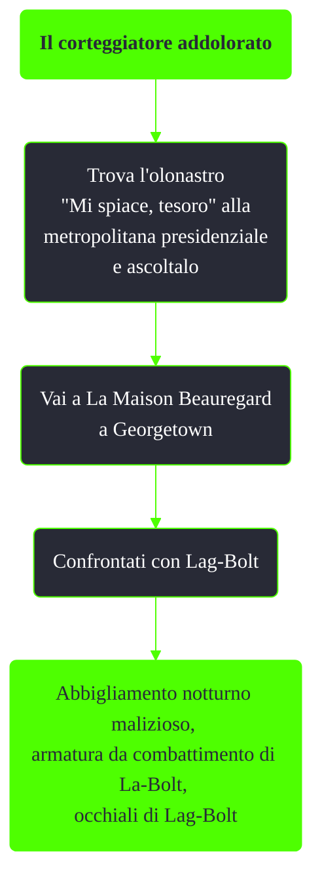

---
# Title, summary, and page position.
linktitle: Il corteggiatore addolorato
summary: ""
weight: 10
icon: message-question
icon_pack: fas

# Page metadata.
title: Il corteggiatore addolorato
date: 2022-11-15
type: book # Do not modify.
commentable: true
tags: "Missioni di Broken Steel"
hidden: true # Visibile nella sidebar
private: false # Nascosto dalle ricerche
---

*Il corteggiatore addolorato* è una missione nascosta del DLC *Broken Steel* di Fallout 3. È data dall'olonastro "Mi spiace, tesoro" che si trova alla metropolitana presidenziale.

<section class="chart-collapse">
<input type="checkbox" name="collapse2" id="handle2">
<h3 class="handle">
<label for="handle2">Clicca per mostrare il diagramma</label>
</h3>

</section>

**Note**:
- L'olonastro si trova su una panchina vicino a uno scheletro, raggiungibile dalle scale prima del treno che porta alla la Base aeronautica Adams 
- Questa missione è connessa con *Pacco di Grady*, che fa ottenere da Lug-Nut, fratello di Lag-Bolt, un altro tipo di abbigliamento notturno malizioso  

