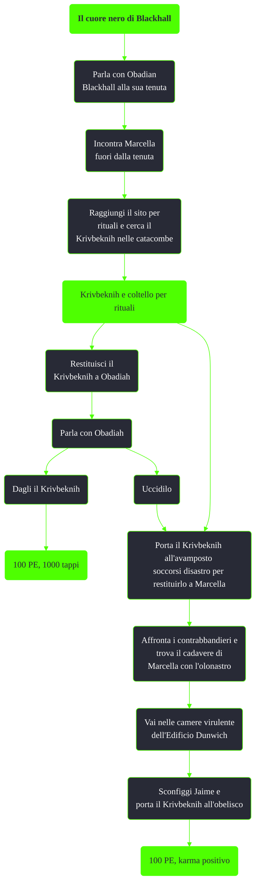

---
# Title, summary, and page position.
linktitle: Il cuore nero di Blackhall
summary: ""
weight: 10
icon: message-question
icon_pack: fas

# Page metadata.
title: Il cuore nero di Blackhall
date: 2022-11-15
type: book # Do not modify.
commentable: true
tags: "Missioni di Point Lookout"
hidden: true # Visibile nella sidebar
private: false # Nascosto dalle ricerche
---

*Il cuore nero di Blackhall* è una missione secondaria del DLC *Point Lookout* di Fallout 3. È data da Obadian Blackhall allsa Tenuta di Blackhall.

<section class="chart-collapse">
<input type="checkbox" name="collapse2" id="handle2">
<h3 class="handle">
<label for="handle2">Clicca per mostrare il diagramma</label>
</h3>

</section>

| Tappe |       Stato        | Descrizione                                                                                   |
|:-----:|:------------------:| --------------------------------------------------------------------------------------------- |
|  10   |                    | Recupera il libro della famiglia Blackhall dal sito dei rituali.                              |
|  15   |                    | Recupera il Krivbeknih dal sito dei rituali.                                                  |
|  29   |                    | Riporta il libro della famiglia Blackhall a Obadiah.                                          |
|  30   |                    | Restituisci il Krivbeknih a Obadiah OPPURE a Marcella.                                        |
|  31   |                    | Restituisci il Krivbeknih a Marcella.                                                         |
|  40   |                    | Indaga sulla scena di morte di Marcella                                                       |
|  240  |                    | Porta il Krivbeknih a Obadiah OPPURE portalo a Dunwich nella Capitale della Zona contaminata. |
|  241  | :white_check_mark: | Porta il Krivbeknih a Dunwich nella Capitale della Zona contaminata.                          |

**Note**:
- Prima di ottenere il libro, è possibile seguire Marcella alla sua tenda 
- Se si uccide Obadiah prima di dargli il libro, non sarà possibile ottenere i 1000 tappi, neanche saccheggiando il suo cadavere 

