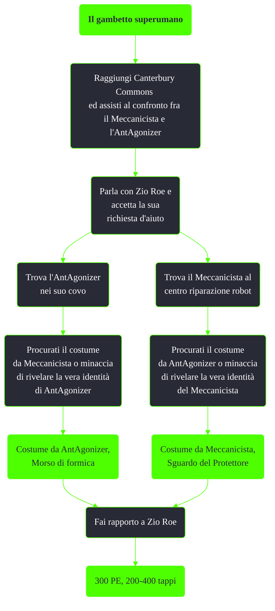

---
# Title, summary, and page position.
linktitle: Il gambetto superumano
summary: ""
weight: 10
icon: messages # message-question per le missioni nascoste
icon_pack: fas

# Page metadata.
title: Il gambetto superumano
date: 2022-11-15
type: book # Do not modify.
commentable: true
tags: "Missioni secondarie di Fallout 3"
hidden: true # Visibile nella sidebar
private: false # Nascosto dalle ricerche
---

*Il gambetto superumano* è una missione secondaria di Fallout 3. È data da Zio Roe a Canterbury Commons.

| Tappe |       Stato        | Descrizione                                                                 |
| :---: | :----------------: | --------------------------------------------------------------------------- |
|  20   |                    | Trova il Meccanicista o l'AntAgonizer e metti fine alla loro rivalità.      |
|  30   |                    | (Facoltativo) Chiedi a Derek informazioni sul Meccanicista e l'AntAgonizer. |
|  70   |                    | Difendi la Fornace dal Meccanicista!                                        |
|  75   |                    | Difendi la Fornace dall'AntAgonizer!                                        |
|  110  |                    | (Facoltativo) Trova il Meccanicista e fermalo.                              |
|  115  |                    | (Facoltativo) Trova l'AntAgonizer e fermala.                                |
|  120  | :white_check_mark: | Presentati in città per ottenere la tua ricompensa.                         |

Note:
- Uccidendo uno dei due o entrambi i rivali, appena arrivati a Canterbury Commons, Zio Roe ci consegnerà subito 400 tappi, ringraziandoci
- È possibile che, ad alti livelli, un deathclaw o uno scorpione albino uccida tutti gli abitanti della città