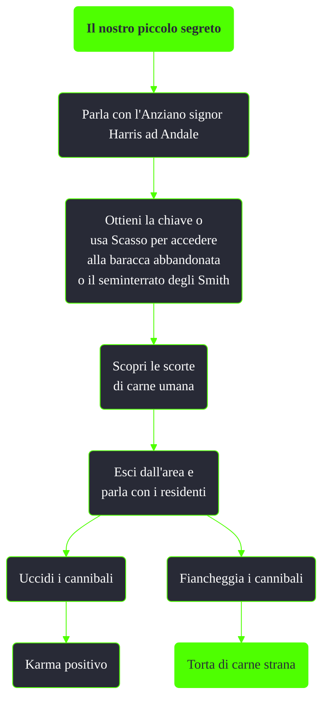

---
# Title, summary, and page position.
linktitle: Il nostro piccolo segreto
summary: ""
weight: 10
icon: message-question
icon_pack: fas

# Page metadata.
title: Il nostro piccolo segreto
date: 2022-11-15
type: book # Do not modify.
commentable: true
tags: "Missioni nascoste di Fallout 3"
hidden: true # Visibile nella sidebar
private: false # Nascosto dalle ricerche
---

*Il nostro piccolo segreto* è una missione nascosta di Fallout 3. È data dall'Anziano signor Harris ad Andale.

**Riassunto**:
1. Parla con l'Anziano signor Harris ad Andale
2. Ottieni la chiave o usa Scasso per accedere alla baracca abbandonata o il seminterrato degli Smith
3. Scopri le scorte di carne umana
4. Esci dall'area e parla con i residenti
   - Uccidi i cannibali: **karma positivo**
   - Fiancheggia i cannibali: **Torta di carne strana**

<section class="chart-collapse">
<input type="checkbox" name="collapse2" id="handle2">
<h3 class="handle">
<label for="handle2">Clicca per mostrare il diagramma</label>
</h3>

</section>

**Note**:
- Uccidere l'Anziano signor Harris non farà guadagnare karma negativo, mentre rubare la carne umana dagli Smith sì

