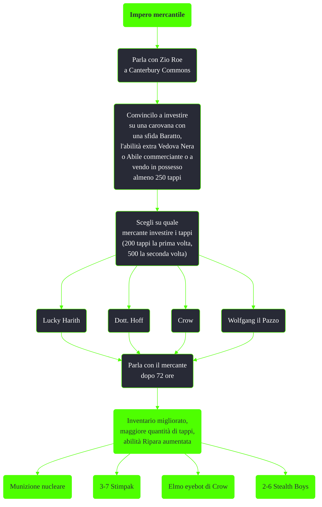

---
# Title, summary, and page position.
linktitle: Impero mercantile
summary: ""
weight: 10
icon: message-question
icon_pack: fas

# Page metadata.
title: Impero mercantile
date: 2022-11-15
type: book # Do not modify.
commentable: true
tags: "Missioni nascoste di Fallout 3"
hidden: true # Visibile nella sidebar
private: false # Nascosto dalle ricerche
---

*Impero mercantile* è una missione nascosta di Fallout 3. E' data da Zio Roe a Canterbury Commons.

Note:
- E' possibile investire i propri tappi su qualsiasi mercante in qualsiasi ordine
- L'inventario verrà migliorato solo dopo il secondo investimento e dopo che sono  trascorse almeno 72 ore di gioco