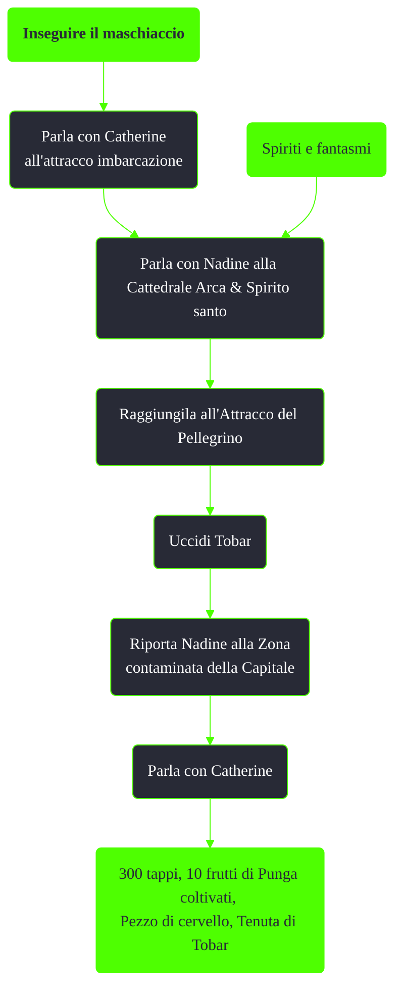

---
# Title, summary, and page position.
linktitle: Inseguire il maschiaccio
summary: ""
weight: 10
icon: message-question
icon_pack: fas

# Page metadata.
title: Inseguire il maschiaccio
date: 2022-11-15
type: book # Do not modify.
commentable: true
tags: "Missioni di Point Lookout"
hidden: true # Visibile nella sidebar
private: false # Nascosto dalle ricerche
---

*Inseguire il maschiaccio* è una missione nascosta del DLC *Point Lookout* di Fallout 3. È data da Catherine all'attracco imbarcazione.

**Riassunto**:
1. Raggiungi l'attracco imbarcazione
2. Parla con Catherine a proposito di sua figlia Nadine
3. (Opzionale) Missione nascosta: Inseguire il maschiaccio
4. Parla con Tobar sulla Duchess Gambit e compra un biglietto per Point Lookout
5. Attiva la branda per viaggiare fino a Point Lookout
6. Approda all'attracco pellegrino
7. Raggiungi la Villa di Calvert e parla con Desmond
8. Aiuta Desmond a difendere la villa dall'ultimo attacco dei tribali
9. Parla di nuovo con Desmond
10. Ricompensa: **300 PE**, **abilità extra: Difensore supremo**
11. Prossima missione: *Spiriti e fantasmi*

<section class="chart-collapse">
<input type="checkbox" name="collapse2" id="handle2">
<h3 class="handle">
<label for="handle2">Clicca per mostrare il diagramma</label>
</h3>

</section>

