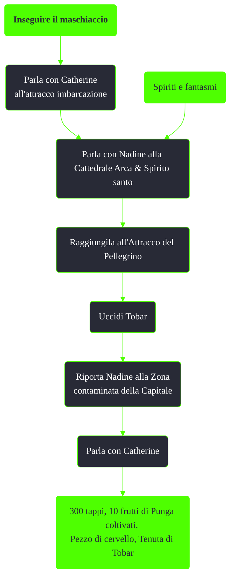

---
# Title, summary, and page position.
linktitle: Inseguire il maschiaccio
summary: ""
weight: 10
icon: message-question
icon_pack: fas

# Page metadata.
title: Inseguire il maschiaccio
date: 2022-11-15
type: book # Do not modify.
commentable: true
tags: "Missioni di Point Lookout"
hidden: true # Visibile nella sidebar
private: false # Nascosto dalle ricerche
---

*Inseguire il maschiaccio* è una missione nascosta del DLC *Point Lookout* di Fallout 3. È data da Catherine all'attracco imbarcazione.

