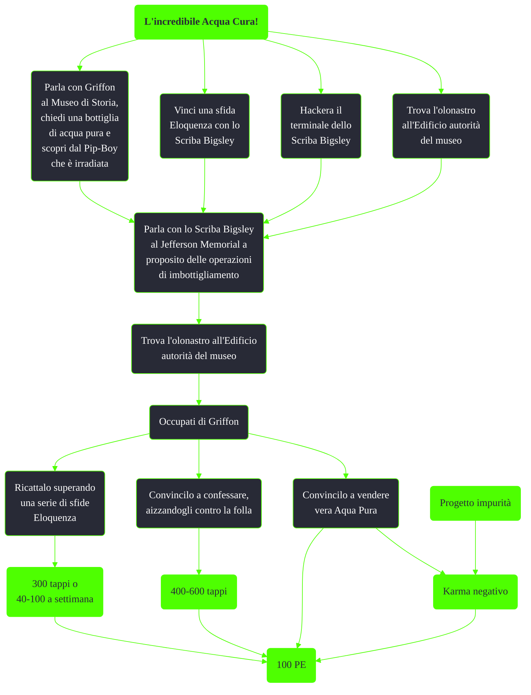

---
# Title, summary, and page position.
linktitle: L'incredibile Acqua Cura!
summary: ""
weight: 10
icon: message-question
icon_pack: fas

# Page metadata.
title: L'incredibile Acqua Cura!
date: 2022-11-15
type: book # Do not modify.
commentable: true
tags: "Missioni di Broken Steel"
hidden: true # Visibile nella sidebar
private: false # Nascosto dalle ricerche
---

*L'incredibile Acqua Cura!* è una missione nascosta del DLC *Broken Steel* di Fallout 3. È data da Griffon al Museo di Storia, dallo Scriba Bigsley o trovando un olonastro all'Edificio autorità del museo.

<section class="chart-collapse">
<input type="checkbox" name="collapse2" id="handle2">
<h3 class="handle">
<label for="handle2">Clicca per mostrare il diagramma</label>
</h3>

</section>

| Tappe |       Stato        | Descrizione |
| :---: | :----------------: | ----------- |
| 5      |                    | Scopri chi fornisce l'Acqua pura a Griffon.            |
| 10      |                    | Vai negli Inferi e scopri cosa sta combinando Griffon con l'Acqua pura.            |
| 20      |                    |    Scopri cosa sa Bigsley al Progetto purezza dei rifornimenti di acqua di Griffon.         |
| 30      |                    | Scopri e il luogo e le prove delle operazioni di imbottigliamento di Griffon.            |
| 40      | :white_check_mark:                   | Parla a Griffon dell'operazione nell'edificio dell'Autorità del museo.            |

**Note**:
- Se si ha aggiunto il FEV in *Progetto impurità* convincere Griffon a vendere Aqua Pura farà guadagnare karma negativo
- E' possibile prendere 600 tappi dal suo inventario senza rendere ostile la folla usando il Mesmetron
- Anche se Griffon accetta di vendere la vera Aqua Pura, lui continuerà a vendere quella irradiata

